# Лабораторна робота 1. Робота з СУБД PostgreSQL та основи SQL

## Загальна інформація

**Здобувач освіти:** [Грушка Андрій Володмирович]
**Група:** [ІПЗ-32]
**Обраний рівень складності:** [3]
## Виконання завдань
## Рівень 1
### Список таблиць

```sql
-- Запит для отримання списку таблиць
SELECT table_name
FROM information_schema.tables
WHERE table_schema = 'public'
ORDER BY table_name;
```

Результат: У базі даних створено 8 основних таблиць: categories, customers, employees, order_items, orders, products, regions, suppliers.

Скріншот 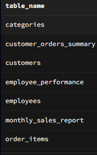


...


### Отримати всі записи з таблиці customers.

```sql
SELECT * FROM customers;
```

Результат: Отримано 15 записів клієнтів, включаючи як фізичних осіб, так і юридичні особи з різних міст України.

Скріншот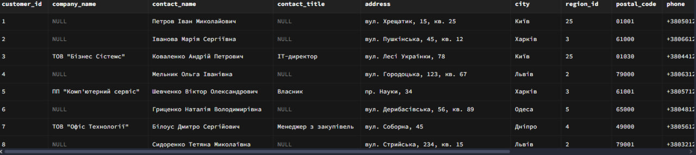

### Вивести тільки назви товарів і їхні ціни з таблиці products.

```sql
SELECT 
    product_name,
    unit_price
FROM products;
```
Результат:Цей запит вибирає назви товарів та їх ціни з таблиці products, показуючи весь каталог товарів з основними даними про них.
Скрішот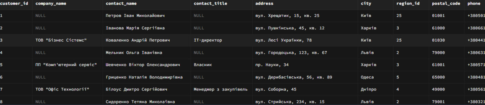

### Показати контактні дані всіх співробітників (ім'я, прізвище, телефон, email).

```sql
SELECT 
    first_name as "Ім'я",
    last_name as "Прізвище",
    phone as "Телефон",
    email as "Email"
FROM employees
ORDER BY last_name, first_name;
```
Результат: Цей запит виводить список співробітників з їх контактними даними, відсортований за прізвищем та ім'ям для зручного перегляду.
Скріншот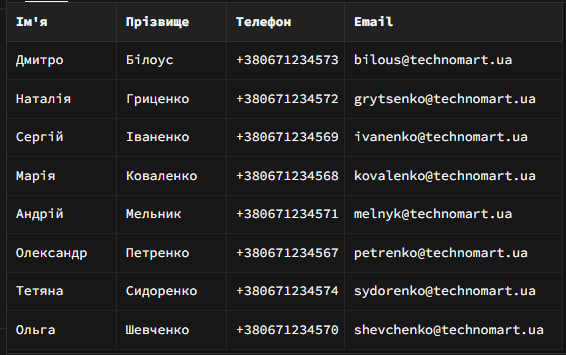
    
### Знайти всіх клієнтів з міста Київ.

```sql
SELECT 
    customer_id as "ID клієнта",
    contact_name as "Контактна особа",
    company_name as "Назва компанії",
    customer_type as "Тип клієнта",
    address as "Адреса",
    city as "Місто",
    phone as "Телефон",
    email as "Email",
    registration_date as "Дата реєстрації"
FROM customers
WHERE city = 'Київ'
ORDER BY contact_name;
```
Результат: Цей запит показує всіх клієнтів з Києва з повною контактною інформацією, відсортованих за іменем контактної особи для локального маркетингу чи обслуговування.

Скріншот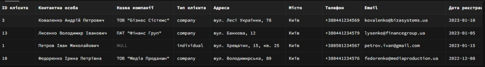

### Вивести товари, які коштують більше 25000 грн.

```sql
SELECT 
    product_id as "ID товару",
    product_name as "Назва товару",
    unit_price as "Ціна",
    units_in_stock as "На складі",
    units_on_order as "В дорозі"
FROM products
WHERE unit_price > 25000
  AND discontinued = false
ORDER BY unit_price DESC;
```

Результат: Цей запит знаходить дорогі товари (понад 25000 грн), які є доступними для продажу, показуючи їх залишки на складі та статус поставок для управління асортиментом.

Скріншот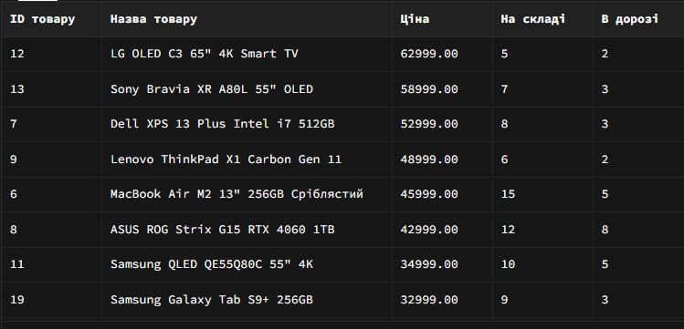


### Показати всі замовлення зі статусом 'delivered'.

```sql
SELECT 
    order_id as "ID замовлення",
    customer_id as "ID клієнта",
    employee_id as "ID співробітника",
    order_date as "Дата замовлення",
    required_date as "Потрібна дата",
    shipped_date as "Дата відправки",
    ship_via as "Спосіб доставки",
    freight as "Вартість доставки",
    order_status as "Статус"
FROM orders
WHERE order_status = 'delivered'
ORDER BY order_date DESC;
```
Результат: Цей запит показує всі успішно доставлені замовлення, відсортовані від найновіших до найстаріших, для аналізу виконаних операцій та історії продажів.

Скріншот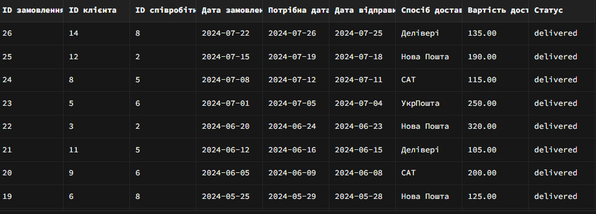

### Знайти співробітників, які працюють у відділі продажів (посада містить слово "продаж").

```sql
SELECT 
    employee_id as "ID співробітника",
    first_name as "Ім'я",
    last_name as "Прізвище",
    title as "Посада",
    phone as "Телефон",
    email as "Email",
    salary as "Зарплата",
    hire_date as "Дата прийому"
FROM employees
WHERE title LIKE '%продаж%'
ORDER BY last_name, first_name;
```

Результат: Цей запит фільтрує співробітників, чиї посади пов'язані з продажами, показуючи їх контактні дані та зарплату для управління відділом продажів.

Скріншот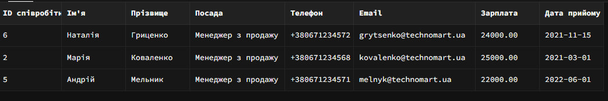

### Відсортувати товари за зростанням ціни.

```sql
SELECT 
    product_id as "ID товару",
    product_name as "Назва товару",
    unit_price as "Ціна"
FROM products
WHERE discontinued = false
  AND unit_price > 0
ORDER BY unit_price ASC;
```

Результат: Цей запит виводить всі доступні товари з їх цінами у зростаючому порядку для створення прайс-листу або каталогу продукції.

Скріншот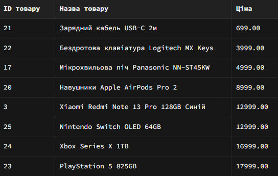

### Показати клієнтів в алфавітному порядку за іменем контактної особи.

```sql
SELECT 
    customer_id as "ID клієнта",
    contact_name as "Контактна особа",
    customer_type as "Тип клієнта",
    company_name as "Назва компанії",
    city as "Місто",
    phone as "Телефон",
    email as "Email"
FROM customers
ORDER BY contact_name ASC;
```
Результат: Цей запит виводить повний список клієнтів, відсортований за алфавітом за іменем контактної особи, для ведення клієнтської бази та комунікацій.

Скріншот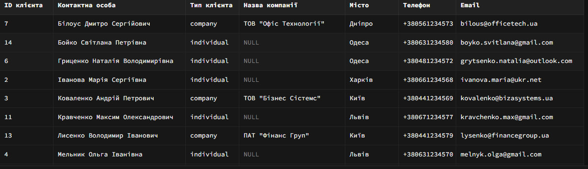

### Вивести замовлення від найновіших до найстаріших.

```sql
-- Варіант 1: Простий запит з усіма деталями
SELECT * 
FROM orders 
ORDER BY order_date DESC;
```
Результат: Цей запит виводить всі записи про замовлення з усіма доступними полями, відсортовані від найновіших до найстаріших для повного огляду всіх транзакцій.

Скріншоти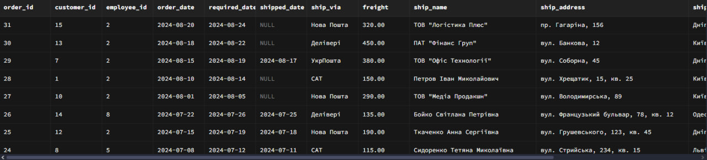

### Показати перші 10 найдорожчих товарів.

```sql
-- Варіант 1: Простий запит з основними даними
SELECT 
    product_name,
    unit_price,
    units_in_stock,
    discontinued
FROM products
ORDER BY unit_price DESC
LIMIT 10;
```

Результат: Цей запит показує топ-10 найдорожчих товарів з інформацією про наявність на складі та статус виробництва для аналізу преміум-сегменту.

Скріншоти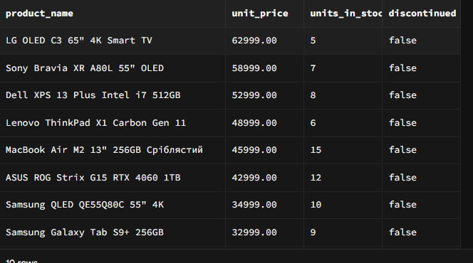

### Вивести 5 останніх замовлень (за датою).

```sql
-- Варіант 1: Простий запит з основними даними
SELECT 
    order_id,
    order_date,
    order_status,
    ship_city,
    ship_via
FROM orders 
ORDER BY order_date DESC
LIMIT 5;
```
Результат: Цей запит виводить 5 останніх замовлень з основним статусом інформації для швидкого перегляду поточних активних транзакцій.

Скріншот 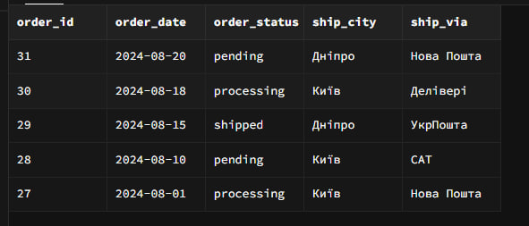

### Отримати перших 8 клієнтів в алфавітному порядку.

```sql
-- Варіант 1: Простий запит з сортуванням за контактною особою
SELECT 
    contact_name,
    customer_type,
    city,
    email,
    phone
FROM customers
ORDER BY contact_name ASC
LIMIT 8;
```

Результат: Цей запит показує перших 8 клієнтів за алфавітом з їх основними контактними даними для вибіркового перегляду клієнтської бази.

Скріншот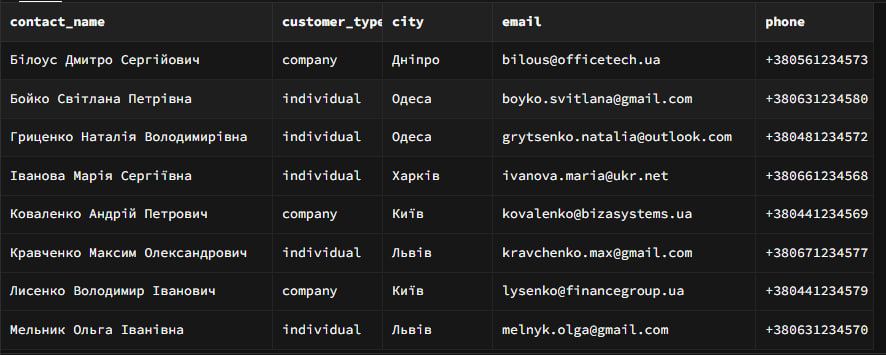

## Рівень 2

### Знайти всіх клієнтів, чиї імена починаються на "Іван".

```sql
-- Варіант 1: Простий пошук за контактною особою
SELECT 
    contact_name,
    customer_type,
    city,
    phone,
    email
FROM customers
WHERE contact_name LIKE 'Іван%'
ORDER BY contact_name ASC;
```

Результат: Цей запит шукає всіх клієнтів, чиї імена починаються на "Іван", для цільової комунікації або аналізу конкретної групи клієнтів.

Скріншот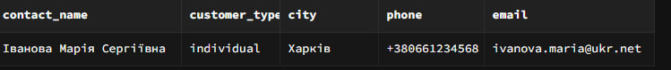

### Вивести товари, в назві яких є слово "phone" або "телефон".

```sql
-- Варіант 1: Простий пошук за назвою товару
SELECT 
    product_name,
    unit_price,
    units_in_stock,
    discontinued
FROM products
WHERE 
    LOWER(product_name) LIKE '%phone%' OR
    LOWER(product_name) LIKE '%телефон%'
ORDER BY product_name ASC;
```
Результат: Цей запит знаходить усі товари, в назві яких згадується телефон (англійською чи українською), для фільтрації мобільних пристроїв у каталозі.

Скріншот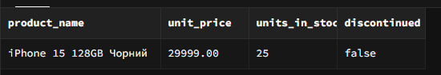

### Придумати та виконати 3 власні запити з використанням LIKE для пошуку за різними зразками (початок, кінець, містить).

```sql
SELECT product_id, product_name, unit_price, units_in_stock
FROM products
WHERE product_name LIKE 'iPhone%' 
   OR product_name LIKE 'MacBook%' 
   OR product_name LIKE 'iPad%' 
   OR product_name LIKE 'Apple%';
```

Результат: Цей запит шукає всі продукти бренду Apple за ключовими назвами продуктів (iPhone, MacBook, iPad, Apple) для аналізу асортименту техніки Apple у магазині.
Скріншот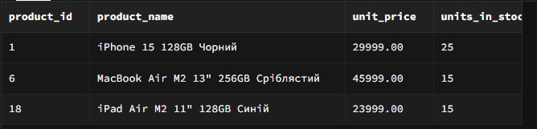

```sql
SELECT product_id, product_name, unit_price, units_in_stock
FROM products
WHERE product_name LIKE '%GB';
```
Результат: Цей запит фільтрує товари, назви яких закінчуються на "GB", що вказує на продукти з визначеним обсягом пам'яті, для аналізу специфікацій зберігання даних.
Скріншот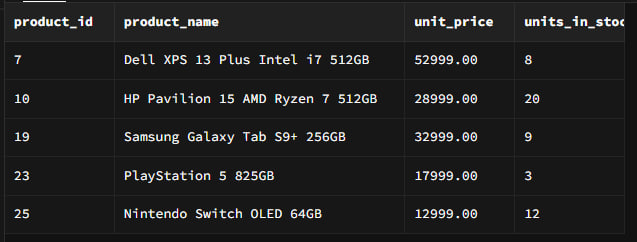

```sql
SELECT product_id, product_name, category_id, unit_price
FROM products
WHERE product_name LIKE '%PlayStation%'
   OR product_name LIKE '%Xbox%'
   OR product_name LIKE '%Nintendo%'
   OR product_name LIKE '%ROG%'
   OR product_name LIKE '%ігров%'
   OR product_name LIKE '%гейм%';
```
Результат: Цей запит знаходить всі товари, назви яких закінчуються на "GB", що вказує на продукти з зазначеною кількістю пам'яті (гігабайт), для аналізу характеристик зберігання.

Скріншот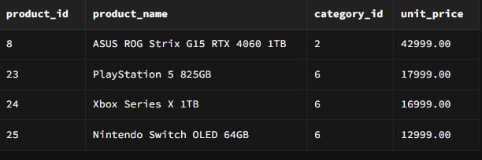

### Знайти товари дорожчі за 15000 грн і дешевші за 50000 грн.

```sql
SELECT 
    product_name,
    unit_price, 
    units_in_stock,
    discontinued
FROM products
WHERE unit_price > 15000 AND unit_price < 50000
ORDER BY unit_price DESC;
```
Результат: Цей запит знаходить всі ігрові продукти (консолі, ПК, аксесуари) за ключовими словами у назвах для аналізу геймінгового асортименту магазину.
Скріншот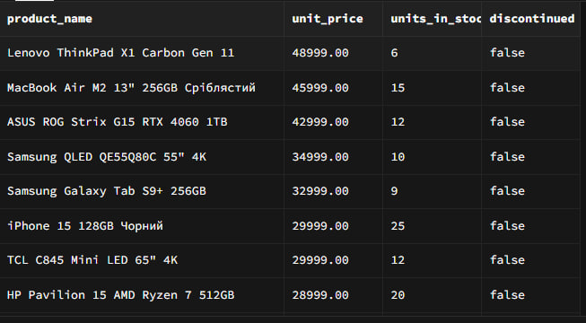

### Вивести клієнтів з Києва або Львова, які є юридичними особами.

```sql
SELECT 
    company_name,
    contact_name,
    contact_title,
    city,
    customer_type,
    email,
    phone
FROM customers
WHERE customer_type = 'company'
  AND (city = 'Київ' OR city = 'Львів')
ORDER BY company_name ASC;
```

Результат:Запит знаходить клієнтів-компаній з **Києва** та **Львова** і виводить їхні контактні дані, відсортовані за назвою компанії.
Скріншот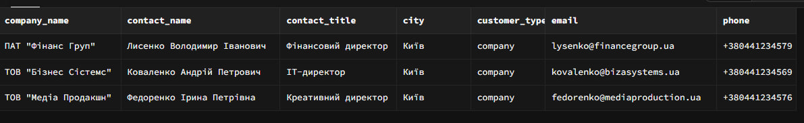


### Самостійно: Створити 4 власні запити з комбінаціями логічних операторів для різних таблиць.

```sql
SELECT product_id, product_name, category_id, unit_price
FROM products
WHERE product_name LIKE '%PlayStation%'
   OR product_name LIKE '%Xbox%'
   OR product_name LIKE '%Nintendo%'
   OR product_name LIKE '%ROG%'
   OR product_name LIKE '%ігров%'
   OR product_name LIKE '%гейм%';
```

Результат: Запит знаходить ігрові товари (консолі, ПК та аксесуари) за ключовими словами в назвах продуктів і виводить їхні ідентифікатори, назви, категорії та ціни.
Скріншот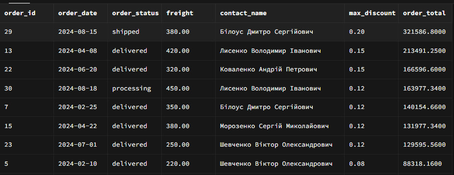


```sql
SELECT 
    p.product_id,
    p.product_name,
    p.unit_price,
    p.units_in_stock,
    c.category_name,
    s.company_name as supplier
FROM products p
JOIN categories c ON p.category_id = c.category_id
JOIN suppliers s ON p.supplier_id = s.supplier_id
WHERE 
    (c.category_name = 'Смартфони та телефони' OR c.category_name = 'Планшети та електронні книги')
    AND p.discontinued = false 
    AND p.units_in_stock > 5 
    AND p.units_in_stock < 20
ORDER BY p.units_in_stock DESC, p.unit_price;
```
Результат: Запит знаходить активні смартфони, телефони та планшети з кількістю на складі від 6 до 19 одиниць і виводить їхні назви, ціни, залишки, категорії та постачальників, відсортовані за кількістю на складі та ціною.
Скріншот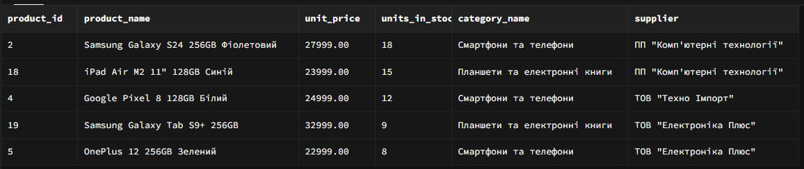

```sql
SELECT 
    c.customer_id,
    c.contact_name,
    c.customer_type,
    c.city,
    COUNT(o.order_id) as total_orders,
    COALESCE(SUM(oi.unit_price * oi.quantity * (1 - oi.discount)), 0) as total_spent
FROM customers c
LEFT JOIN orders o ON c.customer_id = o.customer_id
LEFT JOIN order_items oi ON o.order_id = oi.order_id
WHERE 
    c.customer_type = 'company' 
    OR c.city = 'Київ'
GROUP BY c.customer_id, c.contact_name, c.customer_type, c.city
HAVING 
    COUNT(o.order_id) > 1 
    OR COALESCE(SUM(oi.unit_price * oi.quantity * (1 - oi.discount)), 0) > 50000
ORDER BY total_spent DESC, total_orders DESC;
```
Результат:Запит визначає клієнтів-компаній або клієнтів з **Києва**, які зробили більше одного замовлення або витратили понад **50 000**, та виводить кількість їхніх замовлень і загальну суму витрат, відсортовану за витратами та активністю.
Скріншот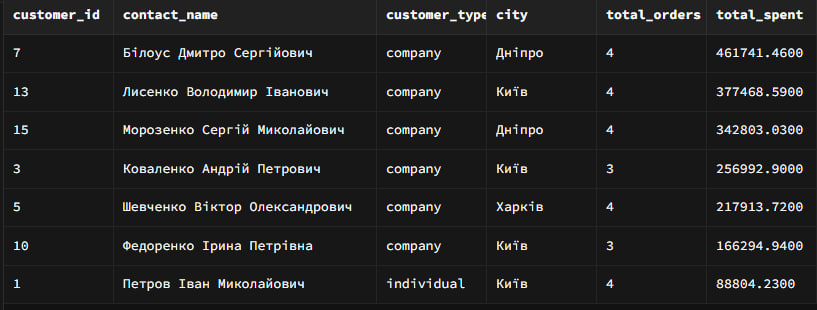

```sql
SELECT 
    p.product_id,
    p.product_name,
    p.unit_price,
    p.units_in_stock,
    p.units_on_order,
    s.company_name,
    r.region_name as supplier_region
FROM products p
JOIN suppliers s ON p.supplier_id = s.supplier_id
JOIN regions r ON s.region_id = r.region_id
WHERE 
    (r.region_name = 'м. Київ' OR r.region_name = 'Львівська область')
    AND p.unit_price > 20000 
    AND p.unit_price <= 50000
    AND (p.units_in_stock > 15 OR p.units_on_order > 0)
ORDER BY p.unit_price DESC, p.units_in_stock DESC;
```
Результат: Запит знаходить дорогі товари від постачальників з **м. Київ** та **Львівської області** з ціною від **20 000 до 50 000**, які є в наявності або замовлені, та виводить інформацію про товар, постачальника і регіон, відсортовану за ціною та залишками.
Скріншот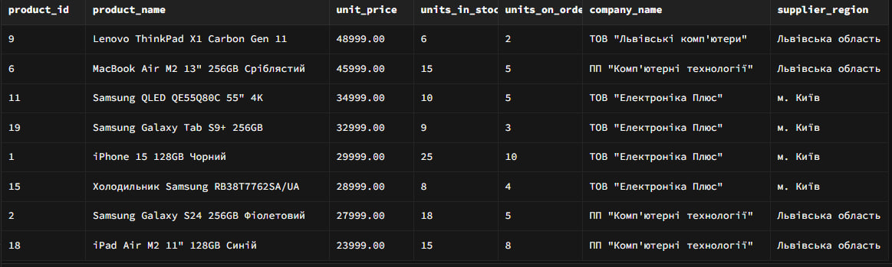


### Вивести клієнтів з міст Київ, Харків, Одеса, Дніпро.

```sql
-- Варіант 1: Простий запит з основними даними
SELECT 
    contact_name,
    COALESCE(company_name, 'Фізична особа') as company_or_individual,
    customer_type,
    city,
    phone,
    email
FROM customers
WHERE city IN ('Київ', 'Харків', 'Одеса', 'Дніпро')
ORDER BY city, contact_name ASC;
```
Результат:Запит виводить контактні дані клієнтів з **Києва, Харкова, Одеси та Дніпра**, зазначаючи компанію або фізичну особу, та сортує результати за містом і ім’ям контакту.
Скріншот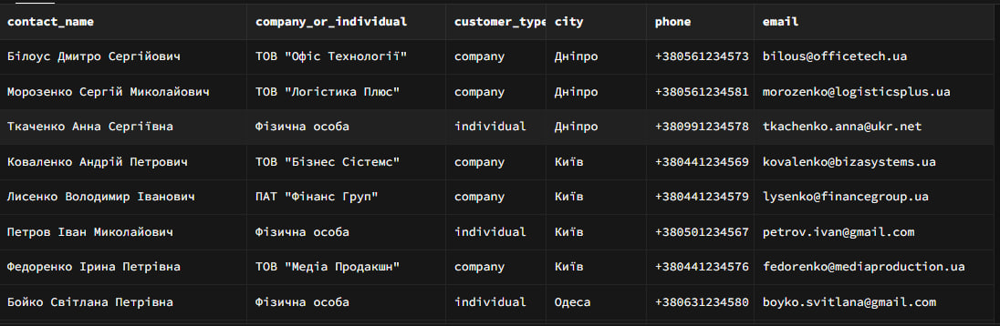

### Знайти товари в ціновому діапазоні від 10000 до 30000 грн.

```sql
-- Варіант 1: Простий запит з основними даними
SELECT 
    product_name,
    unit_price,
    units_in_stock,
    discontinued
FROM products
WHERE unit_price BETWEEN 10000 AND 30000
ORDER BY unit_price DESC;
```
Результат:Запит виводить товари з ціною від **10 000 до 30 000**, показуючи їхню вартість, залишок на складі та статус продажу, відсортовані за ціною у спадному порядку.

Скріншот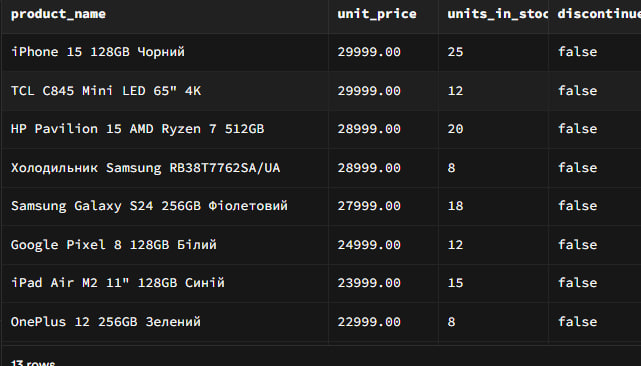

### Самостійно: Придумати та виконати по 2 запити для кожного оператора (IN, BETWEEN, IS NULL/IS NOT NULL).

```sql
SELECT 
    p.product_id,
    p.product_name,
    p.unit_price,
    c.category_name
FROM products p
JOIN categories c ON p.category_id = c.category_id
WHERE c.category_name IN ('Смартфони та телефони', 'Ноутбуки та комп''ютери', 'Планшети та електронні книги')
ORDER BY p.unit_price DESC;
```
Результат:Запит знаходить товари з категорій **смартфонів, ноутбуків та планшетів**, виводить їхні ідентифікатори, назви, ціни й категорії та сортує результати за ціною у спадному порядку.

Скріншот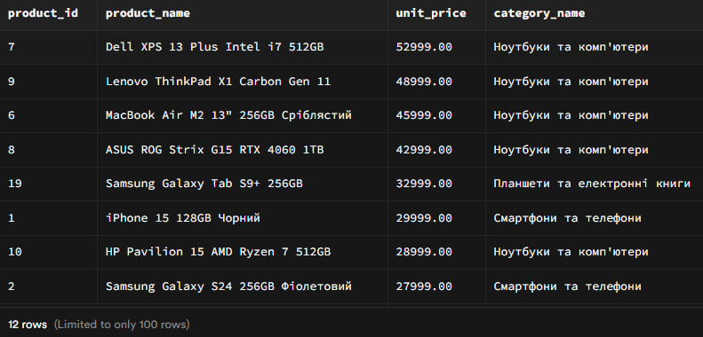


```sql
SELECT 
    o.order_id,
    o.order_date,
    o.order_status,
    o.freight,
    CONCAT(e.first_name, ' ', e.last_name) as employee_name
FROM orders o
JOIN employees e ON o.employee_id = e.employee_id
WHERE o.employee_id IN (2, 5, 6)  -- Співробітники з ID 2, 5, 6
  AND o.order_status = 'delivered'
ORDER BY o.order_date DESC;
```
Результат: Запит виводить доставлені замовлення, оформлені співробітниками з ID **2, 5 та 6**, показуючи номер замовлення, дату, статус, вартість доставки та ім’я співробітника, відсортовані за датою у спадному порядку.
Скріншот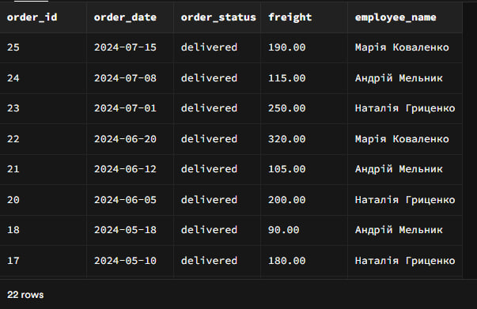


### Запит виводить доставлені замовлення, оформлені співробітниками з ID **2, 5 та 6**, показуючи номер замовлення, дату, статус, вартість доставки та ім’я співробітника, відсортовані за датою у спадному порядку.

```sql
SELECT 
    p.product_id,
    p.product_name,
    p.unit_price,
    p.units_in_stock,
    c.category_name,
    s.company_name as supplier
FROM products p
JOIN categories c ON p.category_id = c.category_id
JOIN suppliers s ON p.supplier_id = s.supplier_id
WHERE (
        (p.product_name LIKE 'iPhone%' OR p.product_name LIKE 'Samsung%')
        AND c.category_name = 'Смартфони та телефони'
      )
      OR (
        (p.product_name LIKE 'iPad%' OR p.product_name LIKE 'Galaxy Tab%')
        AND c.category_name = 'Планшети та електронні книги'
      )
      AND p.unit_price BETWEEN 25000 AND 60000
      AND p.discontinued = false
      AND p.units_in_stock > 0
ORDER BY p.unit_price DESC, p.units_in_stock;

```
Результат: Запит знаходить **смартфони iPhone та Samsung**, а також **планшети iPad і Galaxy Tab** у відповідних категоріях з ціною від **25 000 до 60 000**, які не зняті з продажу та є в наявності, і виводить інформацію про товар, категорію та постачальника, відсортовану за ціною та залишками.
Скріншот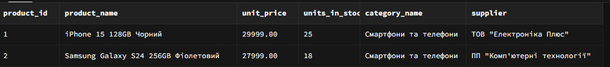

```sql
SELECT 
    o.order_id,
    o.order_date,
    o.required_date,
    o.shipped_date,
    o.order_status,
    c.contact_name,
    c.city as customer_city,
    r.region_name,
    SUM(oi.quantity * oi.unit_price * (1 - oi.discount)) as order_total,
    CASE 
        WHEN o.shipped_date <= o.required_date THEN 'Вчасно'
        ELSE 'Із затримкою'
    END as delivery_status
FROM orders o
JOIN customers c ON o.customer_id = c.customer_id
JOIN regions r ON c.region_id = r.region_id
JOIN order_items oi ON o.order_id = oi.order_id
WHERE o.order_date BETWEEN '2024-01-01' AND '2024-03-31'
  AND c.city IN ('Київ', 'Харків', 'Львів')
  AND o.order_status = 'delivered'
  AND o.shipped_date IS NOT NULL
  AND o.required_date IS NOT NULL
GROUP BY o.order_id, o.order_date, o.required_date, o.shipped_date, 
         o.order_status, c.contact_name, c.city, r.region_name
HAVING SUM(oi.quantity * oi.unit_price * (1 - oi.discount)) > 50000
ORDER BY order_total DESC;
```

Результат:Запит аналізує доставлені замовлення за **I квартал 2024 року** з міст **Київ, Харків і Львів**, обчислює їхню загальну вартість, визначає статус доставки (**вчасно або із затримкою**) та виводить лише замовлення на суму понад **50 000**, відсортовані за сумою замовлення.
Скріншот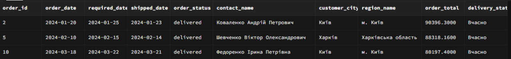


```sql
SELECT 
    p.product_id,
    p.product_name,
    p.unit_price,
    p.units_in_stock,
    c.category_name,
    s.company_name as supplier,
    r.region_name as supplier_region
FROM products p
JOIN categories c ON p.category_id = c.category_id
JOIN suppliers s ON p.supplier_id = s.supplier_id
JOIN regions r ON s.region_id = r.region_id
WHERE NOT p.product_name LIKE 'iPhone%'
  AND NOT p.product_name LIKE 'MacBook%'
  AND NOT p.product_name LIKE 'iPad%'
  AND NOT p.product_name LIKE '%Apple%'
  AND NOT (p.product_name LIKE '%Pro%' OR p.product_name LIKE '%Max%')
  AND c.category_name IN ('Смартфони та телефони', 'Ноутбуки та комп''ютери', 
                         'Телевізори та аудіо', 'Планшети та електронні книги')
  AND r.region_name IN ('м. Київ', 'Львівська область')
  AND p.discontinued = false
ORDER BY c.category_name, p.unit_price DESC;
```

Результат:Запит формує список активних товарів не бренду Apple з вибраних категорій електроніки, що постачаються з м. Київ або Львівської області, відображаючи основні дані про товар, категорію та постачальника, і сортує результат за категорією та ціною за спаданням.
Скріншот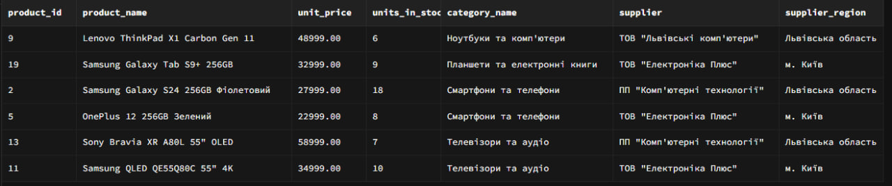


```sql
SELECT 
    s.supplier_id,
    s.company_name,
    s.city,
    r.region_name,
    COUNT(p.product_id) as total_products,
    AVG(p.unit_price) as avg_price,
    SUM(p.units_in_stock) as total_stock,
    MIN(p.unit_price) as min_price,
    MAX(p.unit_price) as max_price
FROM suppliers s
JOIN regions r ON s.region_id = r.region_id
JOIN products p ON s.supplier_id = p.supplier_id
WHERE p.unit_price BETWEEN 10000 AND 40000
  AND (
        p.product_name LIKE '%Samsung%' 
        OR p.product_name LIKE '%LG%' 
        OR p.product_name LIKE '%Sony%'
      )
  AND p.discontinued = false
GROUP BY s.supplier_id, s.company_name, s.city, r.region_name
HAVING COUNT(p.product_id) >= 2  -- Принаймні 2 товари у категорії
ORDER BY total_products DESC, avg_price DESC;
```

Результат:Запит відображає постачальників з регіонами, які мають щонайменше два активні товари Samsung, LG або Sony у ціновому діапазоні 10 000–40 000, з підрахунком кількості, середньої, мінімальної та максимальної ціни, відсортовані за кількістю товарів і середньою ціною.

Скріншот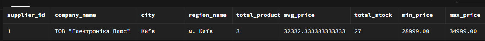


```sql
WITH employee_sales_stats AS (
    SELECT 
        e.employee_id,
        CONCAT(e.first_name, ' ', e.last_name) as full_name,
        e.title,
        e.city as employee_city,
        r.region_name as employee_region,
        -- Статистика продажів
        COUNT(DISTINCT o.order_id) as total_orders,
        COUNT(DISTINCT o.customer_id) as unique_customers,
        SUM(oi.quantity) as total_items_sold,
        COALESCE(SUM(oi.unit_price * oi.quantity * (1 - oi.discount)), 0) as total_revenue,
        AVG(oi.unit_price * oi.quantity * (1 - oi.discount)) as avg_order_value,
        -- Статистика по преміум товарах
        SUM(CASE WHEN p.unit_price >= 30000 THEN oi.quantity ELSE 0 END) as premium_items_sold,
        SUM(CASE WHEN p.unit_price >= 30000 
                THEN oi.unit_price * oi.quantity * (1 - oi.discount) 
                ELSE 0 END) as premium_revenue
    FROM employees e
    LEFT JOIN orders o ON e.employee_id = o.employee_id
    LEFT JOIN order_items oi ON o.order_id = oi.order_id
    LEFT JOIN products p ON oi.product_id = p.product_id
    LEFT JOIN regions r ON e.region_id = r.region_id
    WHERE o.order_status = 'delivered'
      AND o.order_date BETWEEN '2024-01-01' AND '2024-07-31'
      AND (
            -- Товари преміум-класу з певних категорій
            (p.unit_price >= 30000 AND p.category_id IN (
                SELECT category_id 
                FROM categories 
                WHERE category_name LIKE '%ноутбук%' 
                   OR category_name LIKE '%телевізор%'
                   OR category_name LIKE '%преміум%'
            ))
            OR 
            -- Або товари з певних брендів незалежно від ціни
            (p.product_name LIKE '%MacBook%' 
             OR p.product_name LIKE '%Samsung QLED%'
             OR p.product_name LIKE '%LG OLED%')
          )
    GROUP BY e.employee_id, e.first_name, e.last_name, e.title, 
             e.city, r.region_name
),
region_stats AS (
    SELECT 
        employee_region,
        COUNT(DISTINCT employee_id) as total_employees,
        AVG(total_revenue) as avg_revenue_per_employee,
        SUM(total_revenue) as region_total_revenue
    FROM employee_sales_stats
    GROUP BY employee_region
)
SELECT 
    ess.employee_id,
    ess.full_name,
    ess.title,
    ess.employee_city,
    ess.employee_region,
    ess.total_orders,
    ess.unique_customers,
    ess.total_revenue,
    ess.avg_order_value,
    ess.premium_items_sold,
    ess.premium_revenue,
    -- Відсоток преміум-продажів від загальних
    CASE 
        WHEN ess.total_revenue > 0 
        THEN ROUND((ess.premium_revenue / ess.total_revenue) * 100, 2)
        ELSE 0 
    END as premium_sales_percentage,
    -- Класифікація продуктивності
    CASE 
        WHEN ess.total_revenue >= rs.avg_revenue_per_employee * 1.5 THEN 'Високопродуктивний'
        WHEN ess.total_revenue >= rs.avg_revenue_per_employee THEN 'Вище середнього'
        WHEN ess.total_revenue > 0 THEN 'Середній'
        ELSE 'Немає продажів'
    END as performance_category,
    -- Позиція у регіоні
    RANK() OVER (PARTITION BY ess.employee_region ORDER BY ess.total_revenue DESC) as region_rank,
    rs.avg_revenue_per_employee as region_average,
    rs.region_total_revenue
FROM employee_sales_stats ess
JOIN region_stats rs ON ess.employee_region = rs.employee_region
WHERE ess.total_orders > 0  -- Тільки співробітники з продажами
  AND ess.employee_region IN ('м. Київ', 'Львівська область', 'Харківська область')
ORDER BY ess.employee_region, ess.total_revenue DESC, ess.premium_revenue DESC;
```
Результат:Запит оцінює продажі співробітників за доставленими замовленнями у першій половині 2024 року, розраховує загальну та преміум-виручку, визначає продуктивність і рейтинг працівників у межах регіонів та відображає результати для обраних областей, впорядковуючи їх за виручкою.

Скріншот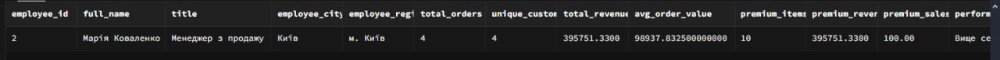

### Самостійно: Написати 3 запити з сортуванням за кількома полями та 2 запити з використанням OFFSET для пагінації.
```sql
SELECT 
    p.product_id,
    p.product_name,
    c.category_name,
    p.unit_price,
    p.units_in_stock,
    p.units_on_order,
    s.company_name as supplier,
    -- Розрахунок загальної вартості товару на складі
    (p.unit_price * p.units_in_stock) as total_stock_value,
    -- Категорія за ціною
    CASE 
        WHEN p.unit_price < 10000 THEN 'Бюджет'
        WHEN p.unit_price BETWEEN 10000 AND 30000 THEN 'Середній'
        WHEN p.unit_price BETWEEN 30001 AND 60000 THEN 'Преміум'
        ELSE 'Люкс'
    END as price_category
FROM products p
JOIN categories c ON p.category_id = c.category_id
JOIN suppliers s ON p.supplier_id = s.supplier_id
WHERE p.discontinued = false
  AND p.units_in_stock > 0
ORDER BY 
    c.category_name ASC,                    -- 1. По категорії (А-Я)
    price_category DESC,                    -- 2. По категорії ціни (від дорогих)
    p.unit_price DESC,                      -- 3. По ціні (від дорогих до дешевих)
    p.units_in_stock DESC,                  -- 4. По наявності (більше на складі)
    p.product_name ASC;                     -- 5. По назві (А-Я)
```

Скріншот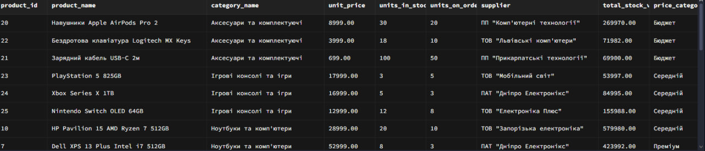

```sql
SELECT 
    o.order_id,
    o.order_date,
    o.required_date,
    o.shipped_date,
    o.order_status,
    c.contact_name,
    c.customer_type,
    -- Розрахунок тривалості обробки (виправлено)
    CASE 
        WHEN o.shipped_date IS NOT NULL 
        THEN EXTRACT(DAY FROM (o.shipped_date::timestamp - o.order_date::timestamp))
        ELSE EXTRACT(DAY FROM (CURRENT_DATE::timestamp - o.order_date::timestamp))
    END as processing_days,
    -- Загальна сума замовлення
    COALESCE(SUM(oi.unit_price * oi.quantity * (1 - oi.discount)), 0) as order_total,
    -- Кількість товарів
    COALESCE(SUM(oi.quantity), 0) as total_items,
    -- Середня ціна товару в замовленні
    CASE 
        WHEN COALESCE(SUM(oi.quantity), 0) > 0
        THEN COALESCE(SUM(oi.unit_price * oi.quantity * (1 - oi.discount)), 0) / COALESCE(SUM(oi.quantity), 0)
        ELSE 0
    END as avg_item_price
FROM orders o
LEFT JOIN customers c ON o.customer_id = c.customer_id
LEFT JOIN order_items oi ON o.order_id = oi.order_id
WHERE o.order_date >= '2024-01-01'
GROUP BY o.order_id, o.order_date, o.required_date, o.shipped_date, 
         o.order_status, c.contact_name, c.customer_type
ORDER BY 
    -- 1. Сортування за статусом (спеціальний порядок)
    CASE o.order_status
        WHEN 'pending' THEN 1
        WHEN 'processing' THEN 2
        WHEN 'shipped' THEN 3
        WHEN 'delivered' THEN 4
        WHEN 'cancelled' THEN 5
        ELSE 6
    END ASC,
    -- 2. По даті замовлення (новіші перші)
    o.order_date DESC,
    -- 3. По сумі замовлення (більші суми перші)
    COALESCE(SUM(oi.unit_price * oi.quantity * (1 - oi.discount)), 0) DESC,
    -- 4. По тривалості обробки (довші перші) - використовуємо вираз з CASE
    CASE 
        WHEN o.shipped_date IS NOT NULL 
        THEN EXTRACT(DAY FROM (o.shipped_date::timestamp - o.order_date::timestamp))
        ELSE EXTRACT(DAY FROM (CURRENT_DATE::timestamp - o.order_date::timestamp))
    END DESC;
```

Скріншот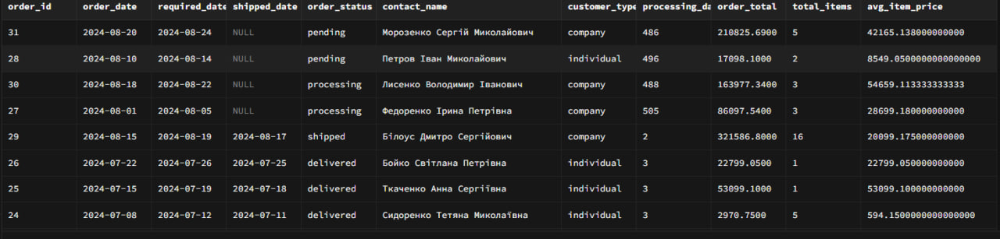

```sql
SELECT 
    c.customer_id,
    c.contact_name,
    c.customer_type,
    c.city,
    r.region_name,
    c.registration_date,
    -- Статистика активності
    COUNT(DISTINCT o.order_id) as total_orders,
    COUNT(DISTINCT DATE_TRUNC('month', o.order_date)) as active_months,
    COALESCE(SUM(oi.unit_price * oi.quantity * (1 - oi.discount)), 0) as total_spent,
    -- Середній чек
    CASE 
        WHEN COUNT(DISTINCT o.order_id) > 0
        THEN COALESCE(SUM(oi.unit_price * oi.quantity * (1 - oi.discount)), 0) / COUNT(DISTINCT o.order_id)
        ELSE 0
    END as avg_order_value,
    -- Дата останнього замовлення
    MAX(o.order_date) as last_order_date,
    -- Днів з останнього замовлення (ВИПРАВЛЕНО)
    CASE 
        WHEN MAX(o.order_date) IS NOT NULL 
        THEN CURRENT_DATE - MAX(o.order_date)
        ELSE NULL
    END as days_since_last_order,
    -- Категорія лояльності
    CASE 
        WHEN COALESCE(SUM(oi.unit_price * oi.quantity * (1 - oi.discount)), 0) > 100000 THEN 'VIP'
        WHEN COALESCE(SUM(oi.unit_price * oi.quantity * (1 - oi.discount)), 0) > 50000 THEN 'Лояльний'
        WHEN COUNT(DISTINCT o.order_id) >= 3 THEN 'Активний'
        WHEN COUNT(DISTINCT o.order_date) IS NULL THEN 'Новий'  -- Змінено умову
        ELSE 'Звичайний'
    END as loyalty_category
FROM customers c
LEFT JOIN regions r ON c.region_id = r.region_id
LEFT JOIN orders o ON c.customer_id = o.customer_id AND o.order_status IN ('delivered', 'shipped', 'processing')
LEFT JOIN order_items oi ON o.order_id = oi.order_id
GROUP BY c.customer_id, c.contact_name, c.customer_type, c.city, 
         r.region_name, c.registration_date
ORDER BY 
    -- 1. По категорії лояльності (спеціальний порядок)
    CASE 
        WHEN COALESCE(SUM(oi.unit_price * oi.quantity * (1 - oi.discount)), 0) > 100000 THEN 1
        WHEN COALESCE(SUM(oi.unit_price * oi.quantity * (1 - oi.discount)), 0) > 50000 THEN 2
        WHEN COUNT(DISTINCT o.order_id) >= 3 THEN 3
        WHEN COUNT(DISTINCT o.order_id) = 0 THEN 5
        ELSE 4
    END ASC,
    -- 2. По загальній сумі витрат (більше витратив - вище)
    COALESCE(SUM(oi.unit_price * oi.quantity * (1 - oi.discount)), 0) DESC,
    -- 3. По кількості замовлень (більше замовлень - вище)
    COUNT(DISTINCT o.order_id) DESC,
    -- 4. По даті реєстрації (новіші перші)
    c.registration_date DESC,
    -- 5. По регіону
    r.region_name ASC;
```

Скріншот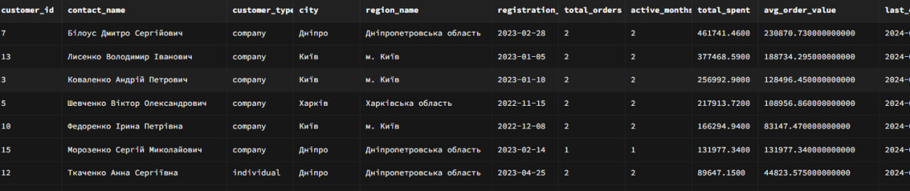

```sql
-- Сторінка 1: Перші 10 найпопулярніших товарів
WITH product_popularity AS (
    SELECT 
        p.product_id,
        p.product_name,
        p.unit_price,
        c.category_name,
        p.units_in_stock,
        p.units_on_order,
        -- Кількість проданих одиниць
        COALESCE(SUM(oi.quantity), 0) as total_sold,
        -- Кількість унікальних замовлень
        COUNT(DISTINCT oi.order_id) as order_count,
        -- Загальний дохід від товару
        COALESCE(SUM(oi.unit_price * oi.quantity * (1 - oi.discount)), 0) as total_revenue,
        -- Рейтинг популярності (продано * замовлень)
        COALESCE(SUM(oi.quantity), 0) * COUNT(DISTINCT oi.order_id) as popularity_score
    FROM products p
    LEFT JOIN categories c ON p.category_id = c.category_id
    LEFT JOIN order_items oi ON p.product_id = oi.product_id
    LEFT JOIN orders o ON oi.order_id = o.order_id AND o.order_status = 'delivered'
    WHERE p.discontinued = false
    GROUP BY p.product_id, p.product_name, p.unit_price, c.category_name, 
             p.units_in_stock, p.units_on_order
)
SELECT 
    product_id,
    product_name,
    unit_price,
    category_name,
    units_in_stock,
    units_on_order,
    total_sold,
    order_count,
    total_revenue,
    popularity_score,
    ROW_NUMBER() OVER (ORDER BY popularity_score DESC, total_revenue DESC) as rank_position
FROM product_popularity
ORDER BY 
    popularity_score DESC,
    total_revenue DESC,
    unit_price DESC
LIMIT 10 OFFSET 0;  -- Сторінка 1

-- Для сторінки 2 (наступні 10 товарів):
-- LIMIT 10 OFFSET 10;

-- Для сторінки 3:
-- LIMIT 10 OFFSET 20;
```

Скріншот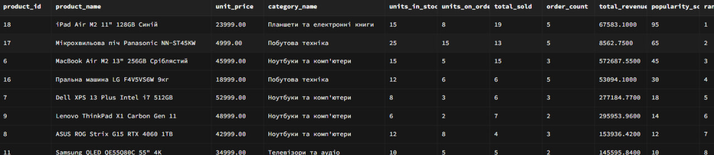

```sql
-- Пагінація для адмін-панелі: замовлення по місяцях
WITH monthly_orders AS (
    SELECT 
        o.order_id,
        o.order_date,
        TO_CHAR(o.order_date, 'YYYY-MM') as order_month,
        o.order_status,
        c.contact_name,
        c.customer_type,
        e.first_name  ' '  e.last_name as employee_name,
        -- Сума замовлення
        COALESCE(SUM(oi.unit_price * oi.quantity * (1 - oi.discount)), 0) as order_total,
        -- Кількість товарів
        COALESCE(SUM(oi.quantity), 0) as item_count,
        -- Вартість доставки
        o.freight,
        -- Загальна вартість з доставкою
        COALESCE(SUM(oi.unit_price * oi.quantity * (1 - oi.discount)), 0) + o.freight as total_with_shipping
    FROM orders o
    JOIN customers c ON o.customer_id = c.customer_id
    JOIN employees e ON o.employee_id = e.employee_id
    LEFT JOIN order_items oi ON o.order_id = oi.order_id
    WHERE o.order_date BETWEEN '2024-01-01' AND '2024-12-31'
      AND o.order_status IN ('delivered', 'shipped', 'processing')
    GROUP BY o.order_id, o.order_date, o.order_status, c.contact_name, 
             c.customer_type, e.first_name, e.last_name, o.freight
),
paged_results AS (
    SELECT 
        order_id,
        order_date,
        order_month,
        order_status,
        contact_name,
        customer_type,
        employee_name,
        order_total,
        item_count,
        freight,
        total_with_shipping,
        -- Номер рядка для пагінації
        ROW_NUMBER() OVER (
            ORDER BY 
                order_date DESC,
                order_total DESC,
                order_id DESC
        ) as row_num,
        -- Загальна кількість записів
        COUNT(*) OVER () as total_records
    FROM monthly_orders
)
SELECT 
    order_id,
    order_date,
    order_month,
    order_status,
    contact_name,
    customer_type,
    employee_name,
    order_total,
    item_count,
    freight,
    total_with_shipping,
    row_num,
    total_records,
    -- Розрахунок загальної кількості сторінок (по 20 записів на сторінку)
    CEIL(total_records / 20.0) as total_pages,
    -- Поточна сторінка
    CEIL(row_num / 20.0) as current_page
FROM paged_results
WHERE row_num BETWEEN 21 AND 40  -- Сторінка 2 (рядки 21-40)
ORDER BY row_num;

-- Для різних сторінок змінюємо WHERE:
-- Сторінка 1: WHERE row_num BETWEEN 1 AND 20
-- Сторінка 3: WHERE row_num BETWEEN 41 AND 60
-- Сторінка N: WHERE row_num BETWEEN ((N-1)*20 + 1) AND (N*20)
```

Скріншот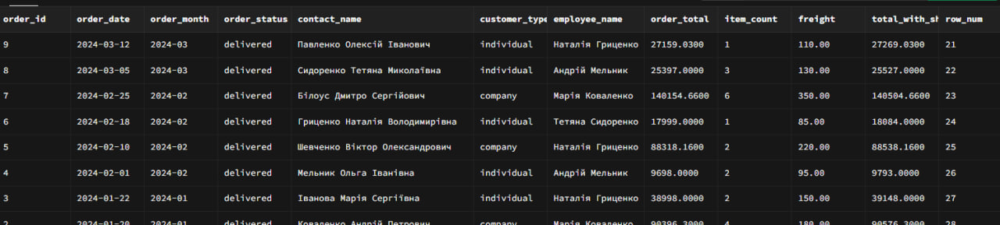

### Знайти товари, в назві яких є "Samsung" або "Apple", але немає слова "чохол".

```sql
-- Варіант 1: Простий запит з основними даними
SELECT 
    product_name,
    unit_price,
    units_in_stock,
    discontinued
FROM products
WHERE (LOWER(product_name) LIKE '%samsung%' OR LOWER(product_name) LIKE '%apple%')
  AND LOWER(product_name) NOT LIKE '%чохол%'
ORDER BY product_name ASC;
```

Скріншот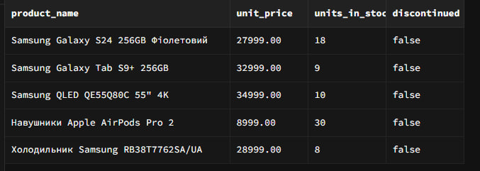

### Самостійно: Створити 4 власні складні запити з комбінаціями LIKE та логічних операторів.

```sql
SELECT 
    p.product_id,
    p.product_name,
    p.unit_price,
    p.units_in_stock,
    p.units_on_order,
    c.category_name,
    s.company_name as supplier,
    -- Класифікація за ціною
    CASE 
        WHEN p.unit_price >= 50000 THEN 'Люкс'
        WHEN p.unit_price BETWEEN 30000 AND 49999 THEN 'Преміум'
        WHEN p.unit_price BETWEEN 15000 AND 29999 THEN 'Середній клас'
        ELSE 'Бюджет'
    END as price_category,
    -- Статус наявності
    CASE 
        WHEN p.units_in_stock > 10 THEN 'В наявності'
        WHEN p.units_in_stock BETWEEN 1 AND 10 THEN 'Обмежена кількість'
        WHEN p.units_on_order > 0 THEN 'Очікується'
        ELSE 'Немає в наявності'
    END as availability_status
FROM products p
JOIN categories c ON p.category_id = c.category_id
JOIN suppliers s ON p.supplier_id = s.supplier_id
WHERE (
        -- Apple продукти з високою ємністю або з Pro/Max у назві
        (p.product_name LIKE 'iPhone%' AND (p.product_name LIKE '%Pro%' OR p.product_name LIKE '%Max%'))
        OR 
        (p.product_name LIKE 'MacBook%' AND p.product_name LIKE '%M2%')
        OR 
        (p.product_name LIKE 'iPad%' AND p.product_name LIKE '%Air%' AND p.product_name LIKE '%M2%')
      )
      OR (
        -- Samsung преміум продукти з QLED, OLED або високою ємністю
        (p.product_name LIKE 'Samsung%' AND (p.product_name LIKE '%QLED%' OR p.product_name LIKE '%OLED%'))
        OR
        (p.product_name LIKE 'Galaxy%' AND (p.product_name LIKE '%256GB%' OR p.product_name LIKE '%512GB%' OR p.product_name LIKE '%1TB%'))
      )
      AND p.discontinued = false
      AND (p.units_in_stock > 0 OR p.units_on_order > 0)
      AND p.unit_price >= 20000
ORDER BY 
    CASE 
        WHEN p.product_name LIKE 'iPhone%' THEN 1
        WHEN p.product_name LIKE 'MacBook%' THEN 2
        WHEN p.product_name LIKE 'iPad%' THEN 3
        WHEN p.product_name LIKE 'Samsung%' THEN 4
        WHEN p.product_name LIKE 'Galaxy%' THEN 5
        ELSE 6
    END,
    p.unit_price DESC,
    p.units_in_stock DESC;
```

Скріншот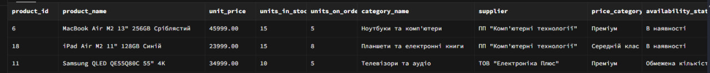

```sql
SELECT 
    c.customer_id,
    c.contact_name,
    c.customer_type,
    c.city,
    r.region_name,
    c.email,
    c.registration_date,
    -- Статистика замовлень
    COUNT(DISTINCT o.order_id) as total_orders,
    COALESCE(SUM(oi.unit_price * oi.quantity * (1 - oi.discount)), 0) as total_spent,
    MAX(o.order_date) as last_order_date,
    -- Аналіз електронної пошти
    CASE 
        WHEN c.email LIKE '%@gmail.com' THEN 'Gmail'
        WHEN c.email LIKE '%@ukr.net' THEN 'Ukr.net'
        WHEN c.email LIKE '%@outlook.com' THEN 'Outlook'
        WHEN c.email LIKE '%@meta.ua' THEN 'Meta.ua'
        WHEN c.email LIKE '%@%.ua' THEN 'Корпоративна Україна'
        ELSE 'Інший'
    END as email_provider
FROM customers c
JOIN regions r ON c.region_id = r.region_id
LEFT JOIN orders o ON c.customer_id = o.customer_id 
    AND o.order_status IN ('delivered', 'shipped')
    AND o.order_date >= '2024-01-01'
LEFT JOIN order_items oi ON o.order_id = oi.order_id
WHERE (
        -- Корпоративні клієнти з Києва чи Харкова
        (c.customer_type = 'company' AND c.city IN ('Київ', 'Харків'))
        OR 
        -- Фізичні особи з великими замовленнями
        (c.customer_type = 'individual' AND (
            EXISTS (
                SELECT 1 
                FROM orders o2 
                JOIN order_items oi2 ON o2.order_id = oi2.order_id
                WHERE o2.customer_id = c.customer_id
                GROUP BY o2.order_id
                HAVING SUM(oi2.unit_price * oi2.quantity * (1 - oi2.discount)) > 20000
            )
        ))
      )
      AND (
        -- Контактна особа з певних позицій
        c.contact_name LIKE '%директор%' 
        OR c.contact_name LIKE '%менеджер%'
        OR c.contact_title LIKE '%директор%'
        OR c.contact_title LIKE '%менеджер%'
      )
      AND c.email IS NOT NULL
      AND c.email NOT LIKE '%test%'
      AND c.email NOT LIKE '%example%'
GROUP BY c.customer_id, c.contact_name, c.customer_type, c.city, 
         r.region_name, c.email, c.registration_date
HAVING 
    COUNT(DISTINCT o.order_id) >= 1 
    OR COALESCE(SUM(oi.unit_price * oi.quantity * (1 - oi.discount)), 0) > 30000
ORDER BY 
    c.customer_type DESC,
    total_spent DESC,
    last_order_date DESC NULLS LAST;
```

Скріншот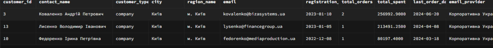

```sql
SELECT 
    e.employee_id,
    e.last_name,
    e.first_name,
    e.middle_name,
    e.title,
    e.city,
    r.region_name,
    e.hire_date,
    e.email,
    e.salary,
    -- Стаж
    EXTRACT(YEAR FROM AGE(CURRENT_DATE, e.hire_date)) as years_of_service,
    -- Статистика продуктивності
    COUNT(DISTINCT o.order_id) as orders_handled,
    COALESCE(SUM(oi.unit_price * oi.quantity * (1 - oi.discount)), 0) as total_sales,
    COUNT(DISTINCT o.customer_id) as unique_customers,
    -- Середня сума замовлення
    CASE 
        WHEN COUNT(DISTINCT o.order_id) > 0
        THEN COALESCE(SUM(oi.unit_price * oi.quantity * (1 - oi.discount)), 0) / COUNT(DISTINCT o.order_id)
        ELSE 0
    END as avg_order_value,
    -- Аналіз посади (винесено в окремий вираз для сортування)
    CASE 
        WHEN e.title LIKE '%директор%' THEN 'Керівництво'
        WHEN e.title LIKE '%менеджер%' AND e.title LIKE '%продаж%' THEN 'Менеджер з продажу'
        WHEN e.title LIKE '%менеджер%' AND e.title LIKE '%закуп%' THEN 'Менеджер з закупівель'
        WHEN e.title LIKE '%бухгалтер%' THEN 'Бухгалтерія'
        WHEN e.title LIKE '%спеціаліст%' THEN 'Спеціаліст'
        WHEN e.title LIKE '%логіст%' THEN 'Логістика'
        ELSE 'Інша посада'
    END as position_category
FROM employees e
LEFT JOIN regions r ON e.region_id = r.region_id
LEFT JOIN orders o ON e.employee_id = o.employee_id
    AND o.order_date >= '2024-01-01'
    AND o.order_status IN ('delivered', 'shipped')
LEFT JOIN order_items oi ON o.order_id = oi.order_id
WHERE (
        -- Співробітники з певних регіонів
        r.region_name IN ('м. Київ', 'Львівська область', 'Харківська область', 'Одеська область')
        AND (
            -- Ключові слова у посаді
            e.title LIKE '%менеджер%'
            OR e.title LIKE '%директор%'
            OR e.title LIKE '%спеціаліст%'
        )
      )
      OR (
        -- Співробітники з високою зарплатою або довгим стажем
        e.salary > 25000
        OR EXTRACT(YEAR FROM AGE(CURRENT_DATE, e.hire_date)) >= 3
      )
      AND e.email IS NOT NULL
      AND e.email LIKE '%@technomart.ua'
GROUP BY e.employee_id, e.last_name, e.first_name, e.middle_name, e.title, 
         e.city, r.region_name, e.hire_date, e.email, e.salary
HAVING 
    -- Фільтрація за результативністю
    COUNT(DISTINCT o.order_id) > 0 
    OR e.salary > 30000
    OR EXTRACT(YEAR FROM AGE(CURRENT_DATE, e.hire_date)) >= 2
ORDER BY 
    -- Використовуємо той самий CASE вираз для сортування
    CASE 
        WHEN e.title LIKE '%директор%' THEN 1
        WHEN e.title LIKE '%менеджер%' AND e.title LIKE '%продаж%' THEN 2
        WHEN e.title LIKE '%менеджер%' AND e.title LIKE '%закуп%' THEN 3
        WHEN e.title LIKE '%бухгалтер%' THEN 4
        WHEN e.title LIKE '%логіст%' THEN 5
        WHEN e.title LIKE '%спеціаліст%' THEN 6
        ELSE 7
    END,
    COALESCE(SUM(oi.unit_price * oi.quantity * (1 - oi.discount)), 0) DESC,
    EXTRACT(YEAR FROM AGE(CURRENT_DATE, e.hire_date)) DESC,
    e.salary DESC;
```
Скріншот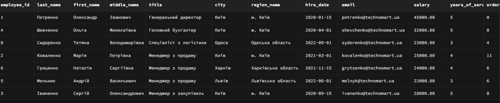

```sql
SELECT 
    c.customer_id,
    c.contact_name,
    c.customer_type,
    c.city,
    r.region_name,
    c.email,
    c.phone,
    c.registration_date,
    -- Статистика замовлень
    COUNT(DISTINCT o.order_id) as total_orders,
    COALESCE(SUM(oi.unit_price * oi.quantity * (1 - oi.discount)), 0) as total_spent,
    MAX(o.order_date) as last_order_date,
    -- Аналіз електронної пошти
    CASE 
        WHEN c.email LIKE '%gmail.com' THEN 'Gmail'
        WHEN c.email LIKE '%ukr.net' THEN 'Ukr.net'
        WHEN c.email LIKE '%outlook.com' THEN 'Outlook'
        WHEN c.email LIKE '%.ua' THEN 'Українська'
        ELSE 'Інший'
    END as email_type,
    -- Аналіз телефону
    CASE 
        WHEN c.phone LIKE '+38050%' THEN 'Vodafone'
        WHEN c.phone LIKE '+38063%' THEN 'Lifecell'
        WHEN c.phone LIKE '+38067%' THEN 'Kyivstar'
        WHEN c.phone LIKE '+38066%' THEN 'Vodafone'
        WHEN c.phone LIKE '+38093%' THEN 'Lifecell'
        WHEN c.phone LIKE '+38097%' THEN 'Kyivstar'
        WHEN c.phone LIKE '+38068%' THEN 'Kyivstar'
        ELSE 'Інший оператор'
    END as mobile_operator
FROM customers c
LEFT JOIN regions r ON c.region_id = r.region_id
LEFT JOIN orders o ON c.customer_id = o.customer_id 
    AND o.order_status IN ('delivered', 'shipped', 'processing')
    AND o.order_date >= '2024-01-01'
LEFT JOIN order_items oi ON o.order_id = oi.order_id
WHERE 
    -- Клієнти з великих міст України
    (
        c.city LIKE '%Київ%'
        OR c.city LIKE '%Харків%'
        OR c.city LIKE '%Львів%'
        OR c.city LIKE '%Одеса%'
        OR c.city LIKE '%Дніпро%'
    )
    AND
    -- Клієнти з корпоративною поштою
    (
        c.email LIKE '%@%.ua'
    )
    AND
    -- Клієнти з контактними даними
    c.email IS NOT NULL
    AND c.phone IS NOT NULL
    AND c.email NOT LIKE '%test%'
    AND c.email NOT LIKE '%example%'
GROUP BY c.customer_id, c.contact_name, c.customer_type, c.city, 
         r.region_name, c.email, c.phone, c.registration_date
HAVING 
    -- Фільтрація за активністю (агрегатні функції перенесені сюди)
    COUNT(DISTINCT o.order_id) >= 2
    OR COALESCE(SUM(oi.unit_price * oi.quantity * (1 - oi.discount)), 0) > 30000
    OR c.customer_type = 'company'
    OR c.registration_date >= '2024-01-01'
ORDER BY 
    -- Сортування за типом клієнта та активністю
    CASE 
        WHEN c.customer_type = 'company' AND COALESCE(SUM(oi.unit_price * oi.quantity * (1 - oi.discount)), 0) > 50000 THEN 1
        WHEN c.customer_type = 'company' THEN 2
        WHEN COUNT(DISTINCT o.order_id) >= 3 THEN 3
        WHEN COALESCE(SUM(oi.unit_price * oi.quantity * (1 - oi.discount)), 0) > 20000 THEN 4
        WHEN c.registration_date >= '2024-01-01' THEN 5
        ELSE 6
    END,
    COALESCE(SUM(oi.unit_price * oi.quantity * (1 - oi.discount)), 0) DESC,
    COUNT(DISTINCT o.order_id) DESC,
    c.registration_date DESC;
```
Скріншот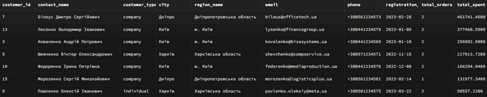

### Знайти товари дорожчі 20000 грн (категорії 1 або 2) АБО товари дешевші 5000 грн будь-якої категорії.

```sql
SELECT *
FROM products
WHERE 
    (unit_price > 20000 AND category_id IN (1, 2))
    OR
    (unit_price < 5000);

```
Скріншот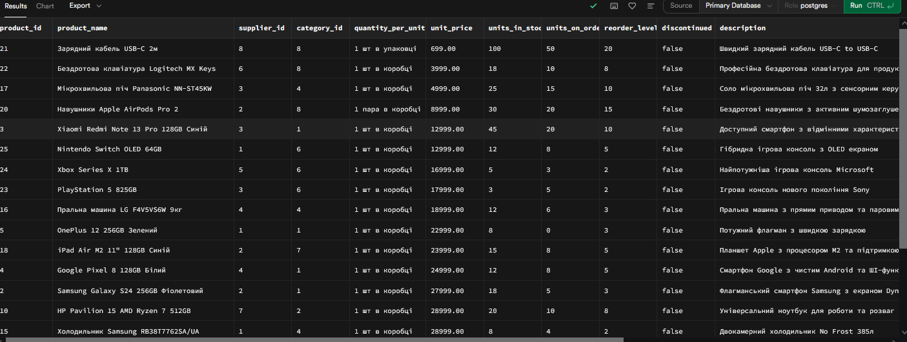

### Самостійно: Написати 3 запити з складними вкладеними умовами, використовуючи дужки для групування логіки.


```sql
SELECT 
    p.product_id,
    p.product_name,
    p.unit_price,
    p.units_in_stock,
    c.category_name,
    s.company_name as supplier,
    -- Класифікація товару
    CASE 
        WHEN (p.product_name LIKE '%Pro%' OR p.product_name LIKE '%Max%' OR p.product_name LIKE '%Ultra%') 
             AND p.unit_price > 30000 
        THEN 'Флагманський'
        WHEN (p.product_name LIKE '%Air%' OR p.product_name LIKE '%Lite%') 
             AND p.unit_price BETWEEN 15000 AND 30000 
        THEN 'Середній клас'
        WHEN (p.product_name LIKE '%Note%' OR p.product_name LIKE '%Redmi%') 
             AND p.unit_price < 15000 
        THEN 'Бюджетний'
        ELSE 'Стандартний'
    END as product_class
FROM products p
JOIN categories c ON p.category_id = c.category_id
JOIN suppliers s ON p.supplier_id = s.supplier_id
WHERE 
    -- Умова 1: Преміум бренди І преміум категорії
    (
        (p.product_name LIKE '%iPhone%' OR p.product_name LIKE '%MacBook%' OR p.product_name LIKE '%iPad%')
        AND 
        (c.category_name LIKE '%смартфон%' OR c.category_name LIKE '%ноутбук%' OR c.category_name LIKE '%планшет%')
    )
    OR
    -- Умова 2: Samsung преміум І (великий запас АБО високий рейтинг)
    (
        (p.product_name LIKE '%Samsung%' OR p.product_name LIKE '%Galaxy%')
        AND 
        p.unit_price > 20000
        AND
        (p.units_in_stock > 10 OR (p.units_in_stock > 5 AND p.units_on_order > 0))
    )
    OR
    -- Умова 3: Техніка для геймінг АБО творчості з високими характеристиками
    (
        (
            (c.category_name LIKE '%ігр%' OR p.product_name LIKE '%PlayStation%' OR p.product_name LIKE '%Xbox%')
            OR
            (c.category_name LIKE '%ноутбук%' AND (p.product_name LIKE '%ROG%' OR p.product_name LIKE '%Gaming%'))
        )
        AND
        (
            p.product_name LIKE '%RTX%' 
            OR p.product_name LIKE '%1TB%' 
            OR p.product_name LIKE '%OLED%'
            OR (p.unit_price > 40000 AND p.units_in_stock > 0)
        )
    )
    AND
    -- Загальні умови для всіх варіантів
    p.discontinued = false
    AND p.units_in_stock + p.units_on_order > 0
    AND p.unit_price BETWEEN 10000 AND 100000
ORDER BY 
    CASE 
        WHEN p.product_name LIKE '%iPhone%' THEN 1
        WHEN p.product_name LIKE '%MacBook%' THEN 2
        WHEN p.product_name LIKE '%Samsung%' AND p.unit_price > 30000 THEN 3
        WHEN p.product_name LIKE '%PlayStation%' OR p.product_name LIKE '%Xbox%' THEN 4
        ELSE 5
    END,
    p.unit_price DESC;
```
Скріншот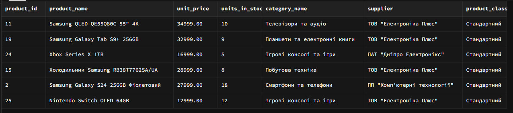

```sql
SELECT 
    c.customer_id,
    c.contact_name,
    c.customer_type,
    c.city,
    r.region_name,
    c.registration_date,
    COUNT(DISTINCT o.order_id) as total_orders,
    COALESCE(SUM(oi.unit_price * oi.quantity * (1 - oi.discount)), 0) as total_spent,
    MAX(o.order_date) as last_order_date
FROM customers c
LEFT JOIN regions r ON c.region_id = r.region_id
LEFT JOIN orders o ON c.customer_id = o.customer_id 
    AND o.order_status IN ('delivered', 'shipped')
    AND o.order_date >= '2024-01-01'
LEFT JOIN order_items oi ON o.order_id = oi.order_id
WHERE 
    -- Умова 1: Корпоративні клієнти з Києва або Харкова
    (
        c.customer_type = 'company'
        AND 
        (c.city = 'Київ' OR c.city = 'Харків')
        AND
        (
            c.contact_name LIKE '%директор%' 
            OR c.contact_title LIKE '%директор%'
            OR c.email LIKE '%@%.ua'
        )
    )
    OR
    -- Умова 2: Активні фізичні особи з великих міст
    (
        c.customer_type = 'individual'
        AND
        (
            c.city IN ('Львів', 'Одеса', 'Дніпро')
            OR r.region_name IN ('Львівська область', 'Одеська область', 'Дніпропетровська область')
        )
    )
    OR
    -- Умова 3: Нові клієнти (2024 рік) з потенціалом
    (
        c.registration_date >= '2024-01-01'
        AND
        (
            (c.customer_type = 'company' AND c.email LIKE '%@%.ua')
            OR
            (c.customer_type = 'individual' AND c.city IN ('Київ', 'Харків', 'Львів'))
            OR
            (c.email LIKE '%gmail.com' AND c.phone LIKE '+380%')
        )
    )
GROUP BY c.customer_id, c.contact_name, c.customer_type, c.city, 
         r.region_name, c.registration_date
HAVING 
    -- Умова для активних фізичних осіб: великі замовлення або багато замовлень
    (
        -- Умова 2 з агрегатними функціями перенесена в HAVING
        (
            c.customer_type = 'individual'
            AND
            (
                c.city IN ('Львів', 'Одеса', 'Дніпро')
                OR r.region_name IN ('Львівська область', 'Одеська область', 'Дніпропетровська область')
            )
            AND
            (
                COALESCE(SUM(oi.unit_price * oi.quantity * (1 - oi.discount)), 0) > 25000
                OR COUNT(DISTINCT o.order_id) >= 3
            )
        )
        OR
        -- Умова 1: Корпоративні клієнти з Києва або Харкова
        (
            c.customer_type = 'company'
            AND 
            (c.city = 'Київ' OR c.city = 'Харків')
            AND
            (
                c.contact_name LIKE '%директор%' 
                OR c.contact_title LIKE '%директор%'
                OR c.email LIKE '%@%.ua'
            )
        )
        OR
        -- Умова 3: Нові клієнти (2024 рік) з потенціалом
        (
            c.registration_date >= '2024-01-01'
            AND
            (
                (c.customer_type = 'company' AND c.email LIKE '%@%.ua')
                OR
                (c.customer_type = 'individual' AND c.city IN ('Київ', 'Харків', 'Львів'))
                OR
                (c.email LIKE '%gmail.com' AND c.phone LIKE '+380%')
            )
        )
    )
    AND
    -- Загальні умови для всіх груп
    (
        COUNT(DISTINCT o.order_id) > 0
        OR c.customer_type = 'company'
        OR c.registration_date >= '2024-06-01'
    )
ORDER BY 
    CASE 
        WHEN c.customer_type = 'company' AND COALESCE(SUM(oi.unit_price * oi.quantity * (1 - oi.discount)), 0) > 50000 THEN 1
        WHEN c.customer_type = 'company' THEN 2
        WHEN COUNT(DISTINCT o.order_id) >= 3 THEN 3
        WHEN COALESCE(SUM(oi.unit_price * oi.quantity * (1 - oi.discount)), 0) > 20000 THEN 4
        WHEN c.registration_date >= '2024-06-01' THEN 5
        ELSE 6
    END,
    COALESCE(SUM(oi.unit_price * oi.quantity * (1 - oi.discount)), 0) DESC,
    COUNT(DISTINCT o.order_id) DESC,
    c.registration_date DESC;
```
Скріншот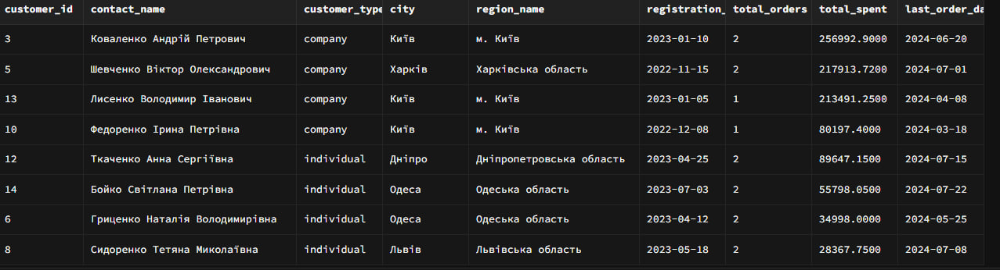

```sql
SELECT 
    o.order_id,
    o.order_date,
    o.order_status,
    c.contact_name,
    c.customer_type,
    SUM(oi.unit_price * oi.quantity * (1 - oi.discount)) as order_total,
    COUNT(DISTINCT oi.product_id) as unique_products,
    CASE 
        WHEN c.customer_type = 'company' AND SUM(oi.unit_price * oi.quantity * (1 - oi.discount)) > 50000 THEN 'Велике корпоративне'
        WHEN c.customer_type = 'individual' AND SUM(oi.unit_price * oi.quantity * (1 - oi.discount)) > 20000 THEN 'Велике приватним'
        WHEN o.order_status IN ('pending', 'processing') THEN 'Поточне'
        ELSE 'Стандартне'
    END as order_category
FROM orders o
JOIN customers c ON o.customer_id = c.customer_id
JOIN order_items oi ON o.order_id = oi.order_id
WHERE 
    o.order_date >= '2024-01-01'
GROUP BY o.order_id, o.order_date, o.order_status, c.contact_name, c.customer_type
HAVING 
    -- Умови з агрегатними функціями
    (
        SUM(oi.unit_price * oi.quantity * (1 - oi.discount)) > 10000
        AND
        (
            (c.customer_type = 'company' AND SUM(oi.unit_price * oi.quantity * (1 - oi.discount)) > 30000)
            OR
            (c.customer_type = 'individual' AND COUNT(DISTINCT oi.product_id) >= 2)
            OR
            o.order_status IN ('pending', 'processing')
        )
    )
ORDER BY 
    order_total DESC,
    o.order_date DESC;
```
Скріншот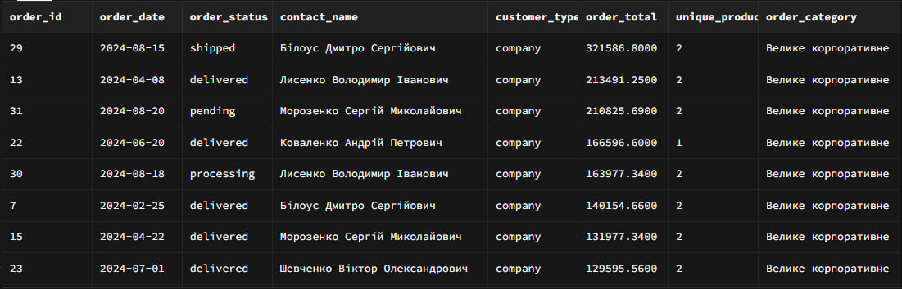

### Самостійно: Створити звіт товарів з 5+ різними умовами фільтрації одночасно.

```sql
WITH product_stats AS (
    SELECT 
        p.product_id,
        p.product_name,
        p.unit_price,
        p.units_in_stock,
        p.units_on_order,
        p.reorder_level,
        p.discontinued,
        c.category_name,
        s.company_name as supplier,
        s.city as supplier_city,
        r.region_name as supplier_region,
        -- Статистика продажів
        COALESCE(SUM(oi.quantity), 0) as total_sold,
        COALESCE(SUM(oi.unit_price * oi.quantity * (1 - oi.discount)), 0) as sales_revenue,
        COUNT(DISTINCT oi.order_id) as order_count,
        -- Дата останнього продажу
        MAX(o.order_date) as last_sale_date
    FROM products p
    JOIN categories c ON p.category_id = c.category_id
    JOIN suppliers s ON p.supplier_id = s.supplier_id
    JOIN regions r ON s.region_id = r.region_id
    LEFT JOIN order_items oi ON p.product_id = oi.product_id
    LEFT JOIN orders o ON oi.order_id = o.order_id AND o.order_status = 'delivered'
    GROUP BY p.product_id, p.product_name, p.unit_price, p.units_in_stock, 
             p.units_on_order, p.reorder_level, p.discontinued,
             c.category_name, s.company_name, s.city, r.region_name
)
SELECT 
    product_id,
    product_name,
    unit_price,
    units_in_stock,
    units_on_order,
    category_name,
    supplier,
    supplier_city,
    supplier_region,
    total_sold,
    sales_revenue,
    order_count,
    last_sale_date,
    -- Аналітичні показники
    CASE 
        WHEN units_in_stock = 0 THEN 'Немає в наявності'
        WHEN units_in_stock < reorder_level THEN 'Нижче мінімального запасу'
        WHEN units_in_stock < 5 THEN 'Критично мало'
        WHEN units_in_stock BETWEEN 5 AND 15 THEN 'Обмежена кількість'
        WHEN units_in_stock BETWEEN 16 AND 50 THEN 'Достатньо'
        ELSE 'Великий запас'
    END as stock_status,
    
    CASE 
        WHEN total_sold = 0 THEN 'Без продажів'
        WHEN total_sold < 5 THEN 'Низький попит'
        WHEN total_sold BETWEEN 5 AND 15 THEN 'Середній попит'
        WHEN total_sold > 15 THEN 'Високий попит'
        ELSE 'Стабільний попит'
    END as demand_level,
    
    CASE 
        WHEN unit_price < 10000 THEN 'Бюджетний'
        WHEN unit_price BETWEEN 10000 AND 29999 THEN 'Середній клас'
        WHEN unit_price BETWEEN 30000 AND 59999 THEN 'Преміум'
        ELSE 'Люкс'
    END as price_segment,
    
    -- Рентабельність запасу
    (unit_price * units_in_stock) as stock_value,
    
    -- Дні оберту (орієнтовно)
    CASE 
        WHEN total_sold > 0 
        THEN ROUND(units_in_stock * 30.0 / total_sold, 1)
        ELSE 999
    END as days_of_supply,
    
    -- Рекомендації
    CASE 
        WHEN units_in_stock = 0 AND total_sold > 0 THEN 'ТЕРМІНОВЕ ПОПОВНЕННЯ'
        WHEN units_in_stock < reorder_level AND total_sold > 5 THEN 'ПОПОВНИТИ ЗАПАС'
        WHEN units_in_stock > 50 AND total_sold < 2 THEN 'ЗНИЗИТИ ЦІНУ АКЦІЄЮ'
        WHEN units_on_order > 0 THEN 'В ДОРОЗІ'
        WHEN discontinued = true THEN 'ЗНЯТИЙ З ПРОДАЖУ'
        ELSE 'СТАБІЛЬНА СИТУАЦІЯ'
    END as recommendation
FROM product_stats
WHERE 
    -- Умова 1: Не зняті з продажу
    discontinued = false
    
    -- Умова 2: Товари з певних категорій (електроніка та техніка)
    AND (
        category_name LIKE '%смартфон%' 
        OR category_name LIKE '%ноутбук%'
        OR category_name LIKE '%планшет%'
        OR category_name LIKE '%телевізор%'
        OR category_name LIKE '%побутова%'
        OR category_name LIKE '%ігр%'
    )
    
    -- Умова 3: Постачальники з певних регіонів
    AND supplier_region IN (
        'м. Київ', 
        'Львівська область', 
        'Харківська область', 
        'Одеська область',
        'Дніпропетровська область'
    )
    
    -- Умова 4: Ціновий діапазон (не надто дешеві і не надто дорогі)
    AND unit_price BETWEEN 5000 AND 80000
    
    -- Умова 5: Товари, які потребують уваги (низький запас або високий попит)
    AND (
        -- Низький запас
        units_in_stock < reorder_level
        OR 
        units_in_stock < 5
        OR 
        -- Високий попит (продано багато)
        (
            total_sold > 10 
            AND units_in_stock < 20
        )
        OR
        -- Дорогі товари з запасом
        (unit_price > 30000 AND units_in_stock > 0)
        OR
        -- Товари в дорозі
        units_on_order > 0
        OR
        -- Популярні бренди
        (
            product_name LIKE '%iPhone%'
            OR product_name LIKE '%Samsung%'
            OR product_name LIKE '%MacBook%'
            OR product_name LIKE '%PlayStation%'
            OR product_name LIKE '%Xbox%'
        )
    )
    
    -- Умова 6: Товари з останніми продажами (2024 рік) або без продажів
    AND (
        last_sale_date >= '2024-01-01'
        OR total_sold = 0
    )
    
    -- Умова 7: Товари з певними характеристиками у назві
    AND (
        -- Продуктивність/об'єм
        product_name LIKE '%256GB%'
        OR product_name LIKE '%512GB%'
        OR product_name LIKE '%1TB%'
        OR product_name LIKE '%Pro%'
        OR product_name LIKE '%OLED%'
        OR product_name LIKE '%QLED%'
        OR product_name LIKE '%RTX%'
        -- АБО не мають цих характеристик, але коштують > 40000
        OR (unit_price > 40000)
    )
    
    -- Умова 8: Фільтрація за результатами агрегації
    AND (
        -- Вартість товарів на складі
        (unit_price * units_in_stock) > 0
        
        -- Або висока виручка від продажів
        OR sales_revenue > 50000
        
        -- Або багато замовлень
        OR order_count >= 3
    )
    
    -- Умова 9: Виключаємо товари з дуже низьким обертом
    AND NOT (
        units_in_stock > 30 
        AND total_sold < 2
        AND unit_price < 20000
    )
ORDER BY 
    -- Пріоритет сортування (повторюємо CASE для рекомендацій)
    CASE 
        WHEN units_in_stock = 0 AND total_sold > 0 THEN 1
        WHEN units_in_stock < reorder_level AND total_sold > 5 THEN 2
        WHEN units_on_order > 0 THEN 3
        WHEN units_in_stock > 50 AND total_sold < 2 THEN 4
        ELSE 5
    END,
    
    -- Сортування за рівнем попиту (повторюємо CASE)
    CASE 
        WHEN total_sold > 15 THEN 1
        WHEN total_sold BETWEEN 5 AND 15 THEN 2
        WHEN total_sold < 5 AND total_sold > 0 THEN 3
        WHEN total_sold = 0 THEN 4
        ELSE 5
    END,
    
    -- Сортування за статусом запасу (повторюємо CASE)
    CASE 
        WHEN units_in_stock = 0 THEN 1
        WHEN units_in_stock < reorder_level THEN 2
        WHEN units_in_stock < 5 THEN 3
        WHEN units_in_stock BETWEEN 5 AND 15 THEN 4
        ELSE 5
    END,
    
    -- За ціною (від дорогих до дешевих)
    unit_price DESC,
    
    -- За категорією
    category_name,
    
    -- За кількістю проданих
    total_sold DESC;
```
Скріншот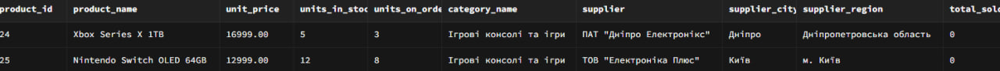

```sql
SELECT 
    c.customer_id,
    c.contact_name,
    c.customer_type,
    c.city,
    r.region_name,
    c.email,
    COUNT(DISTINCT o.order_id) as total_orders,
    COALESCE(SUM(oi.unit_price * oi.quantity * (1 - oi.discount)), 0) as total_spent
FROM customers c
LEFT JOIN regions r ON c.region_id = r.region_id
LEFT JOIN orders o ON c.customer_id = o.customer_id 
    AND o.order_status = 'delivered'
    AND o.order_date >= '2024-01-01'
LEFT JOIN order_items oi ON o.order_id = oi.order_id
WHERE 
    c.city IN ('Київ', 'Харків', 'Львів', 'Одеса')
    AND c.email IS NOT NULL
    AND c.email LIKE '%gmail.com'
GROUP BY c.customer_id, c.contact_name, c.customer_type, c.city, 
         r.region_name, c.email
HAVING 
    COUNT(DISTINCT o.order_id) > 0
    AND COALESCE(SUM(oi.unit_price * oi.quantity * (1 - oi.discount)), 0) > 5000
ORDER BY 
    total_spent DESC,
    total_orders DESC;
```
Скріншот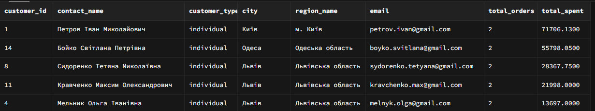

```sql
SELECT 
    -- Сегмент
    segment,
    
    -- Кількість товарів
    product_count,
    
    -- Загальний запас
    total_stock,
    
    -- Загальна вартість запасів
    total_stock_value,
    
    -- Середня ціна
    avg_price,
    
    -- Продажі
    total_sold,
    
    -- Виручка
    total_revenue,
    
    -- Середня виручка на товар
    ROUND(total_revenue / NULLIF(product_count, 0), 2) as revenue_per_product,
    
    -- Обертовість
    ROUND(total_sold * 1.0 / NULLIF(total_stock, 0), 2) as stock_turnover,
    
    -- Продуктивність сегменту
    CASE 
        WHEN total_revenue > 100000 THEN 'Високопродуктивний'
        WHEN total_revenue > 50000 THEN 'Продуктивний'
        WHEN total_revenue > 10000 THEN 'Середній'
        ELSE 'Низькопродуктивний'
    END as segment_performance

FROM (
    SELECT 
        CASE 
            WHEN p.unit_price < 15000 THEN 'Бюджетний'
            WHEN p.unit_price BETWEEN 15000 AND 34999 THEN 'Середній'
            WHEN p.unit_price BETWEEN 35000 AND 59999 THEN 'Преміум'
            ELSE 'Люкс'
        END as segment,
        
        COUNT(DISTINCT p.product_id) as product_count,
        SUM(p.units_in_stock) as total_stock,
        SUM(p.unit_price * p.units_in_stock) as total_stock_value,
        ROUND(AVG(p.unit_price), 2) as avg_price,
        
        COALESCE(SUM(oi.quantity), 0) as total_sold,
        COALESCE(SUM(oi.unit_price * oi.quantity * (1 - oi.discount)), 0) as total_revenue
        
    FROM products p
    LEFT JOIN order_items oi ON p.product_id = oi.product_id
    LEFT JOIN orders o ON oi.order_id = o.order_id AND o.order_status = 'delivered'
    WHERE p.discontinued = false
    GROUP BY 
        CASE 
            WHEN p.unit_price < 15000 THEN 'Бюджетний'
            WHEN p.unit_price BETWEEN 15000 AND 34999 THEN 'Середній'
            WHEN p.unit_price BETWEEN 35000 AND 59999 THEN 'Преміум'
            ELSE 'Люкс'
        END
) as segment_data

ORDER BY 
    CASE segment
        WHEN 'Люкс' THEN 1
        WHEN 'Преміум' THEN 2
        WHEN 'Середній' THEN 3
        ELSE 4
    END;
```
Скріншот

```sql
SELECT 
    -- Ціновий сегмент
    CASE 
        WHEN p.unit_price < 10000 THEN 'Бюджет'
        WHEN p.unit_price BETWEEN 10000 AND 29999 THEN 'Середній клас'
        WHEN p.unit_price BETWEEN 30000 AND 59999 THEN 'Преміум'
        ELSE 'Люкс'
    END as price_segment,
    
    -- Загальна статистика
    COUNT(DISTINCT p.product_id) as unique_products,
    COUNT(DISTINCT oi.order_id) as total_orders,
    SUM(oi.quantity) as total_units_sold,
    
    -- Фінансова статистика
    ROUND(SUM(oi.unit_price * oi.quantity * (1 - oi.discount)), 2) as total_revenue,
    ROUND(AVG(oi.unit_price * oi.quantity * (1 - oi.discount)), 2) as avg_order_value_per_item,
    
    -- Середня знижка
    ROUND(AVG(oi.discount) * 100, 2) as avg_discount_percent,
    
    -- Найпопулярніші категорії
    STRING_AGG(DISTINCT c.category_name, ', ') as categories_in_segment,
    
    -- Популярність сегмента
    CASE 
        WHEN SUM(oi.quantity) > 20 THEN 'Високий попит'
        WHEN SUM(oi.quantity) BETWEEN 10 AND 20 THEN 'Середній попит'
        WHEN SUM(oi.quantity) > 0 THEN 'Низький попит'
        ELSE 'Немає продажів'
    END as demand_level,
    
    -- Рентабельність
    ROUND(SUM(oi.unit_price * oi.quantity * (1 - oi.discount)) / NULLIF(COUNT(DISTINCT oi.order_id), 0), 2) as revenue_per_order

FROM products p
LEFT JOIN categories c ON p.category_id = c.category_id
LEFT JOIN order_items oi ON p.product_id = oi.product_id
LEFT JOIN orders o ON oi.order_id = o.order_id AND o.order_status = 'delivered'
WHERE p.discontinued = false
GROUP BY 
    CASE 
        WHEN p.unit_price < 10000 THEN 'Бюджет'
        WHEN p.unit_price BETWEEN 10000 AND 29999 THEN 'Середній клас'
        WHEN p.unit_price BETWEEN 30000 AND 59999 THEN 'Преміум'
        ELSE 'Люкс'
    END

ORDER BY 
    total_revenue DESC,
    total_units_sold DESC;
```
Скріншот

```sql
WITH price_segments AS (
    SELECT 
        p.product_id,
        p.product_name,
        p.unit_price,
        p.units_in_stock,
        c.category_name,
        s.company_name as supplier,
        
        -- Визначення цінового сегменту
        CASE 
            WHEN p.unit_price < 8000 THEN 'Бюджетний'
            WHEN p.unit_price BETWEEN 8000 AND 19999 THEN 'Економ'
            WHEN p.unit_price BETWEEN 20000 AND 34999 THEN 'Середній'
            WHEN p.unit_price BETWEEN 35000 AND 54999 THEN 'Преміум'
            ELSE 'Люкс'
        END as price_segment,
        
        -- Статистика продажів
        COALESCE(SUM(oi.quantity), 0) as total_sold,
        COALESCE(SUM(oi.unit_price * oi.quantity * (1 - oi.discount)), 0) as sales_revenue
        
    FROM products p
    JOIN categories c ON p.category_id = c.category_id
    JOIN suppliers s ON p.supplier_id = s.supplier_id
    LEFT JOIN order_items oi ON p.product_id = oi.product_id
    LEFT JOIN orders o ON oi.order_id = o.order_id AND o.order_status = 'delivered'
    WHERE p.discontinued = false
    GROUP BY p.product_id, p.product_name, p.unit_price, p.units_in_stock,
             c.category_name, s.company_name
)
SELECT 
    price_segment,
    product_name,
    category_name,
    supplier,
    unit_price,
    units_in_stock,
    total_sold,
    sales_revenue,
    
    -- Аналіз позиції в сегменті
    CASE 
        WHEN total_sold = 0 THEN 'Без продажів'
        WHEN total_sold <= 3 THEN 'Низький попит'
        WHEN total_sold BETWEEN 4 AND 10 THEN 'Середній попит'
        ELSE 'Високий попит'
    END as sales_performance,
    
    -- Вартість запасів
    unit_price * units_in_stock as stock_value,
    
    -- Обертовість
    CASE 
        WHEN total_sold > 0 AND units_in_stock > 0 
        THEN ROUND(total_sold * 1.0 / units_in_stock, 2)
        ELSE 0
    END as turnover_ratio,
    
    -- Рекомендації
    CASE 
        WHEN units_in_stock = 0 AND total_sold > 0 THEN 'Поповнити запас'
        WHEN units_in_stock > 20 AND total_sold < 2 THEN 'Розглянути знижку'
        WHEN total_sold > 10 AND units_in_stock < 5 THEN 'Збільшити запас'
        WHEN total_sold = 0 AND units_in_stock > 15 THEN 'Рекламувати'
        ELSE 'Стабільно'
    END as recommendation,
    
    -- Рейтинг у сегменті (за продажами)
    RANK() OVER (PARTITION BY price_segment ORDER BY total_sold DESC) as rank_in_segment

FROM price_segments
WHERE price_segment IN ('Преміум', 'Люкс', 'Середній')  -- Аналізуємо цікаві сегменти
ORDER BY 
    CASE price_segment
        WHEN 'Люкс' THEN 1
        WHEN 'Преміум' THEN 2
        WHEN 'Середній' THEN 3
        WHEN 'Економ' THEN 4
        ELSE 5
    END,
    total_sold DESC,
    unit_price DESC;
```
Скріншот

### Самостійно: Написати запит для аналізу клієнтської бази з множинними критеріями відбору.


```sql
SELECT 
    r.region_name,
    c.city,
    
    -- Загальна кількість клієнтів
    COUNT(DISTINCT c.customer_id) as total_customers,
    
    -- Активні клієнти (з замовленнями)
    COUNT(DISTINCT CASE 
        WHEN o.order_id IS NOT NULL 
        THEN c.customer_id 
    END) as active_customers,
    
    -- Відсоток активних
    ROUND(
        COUNT(DISTINCT CASE WHEN o.order_id IS NOT NULL THEN c.customer_id END) * 100.0 /
        NULLIF(COUNT(DISTINCT c.customer_id), 0), 
    2) as active_percentage,
    
    -- Загальна сума замовлень
    COALESCE(SUM(oi.unit_price * oi.quantity * (1 - oi.discount)), 0) as total_revenue,
    
    -- Середній чек по регіону
    ROUND(
        COALESCE(SUM(oi.unit_price * oi.quantity * (1 - oi.discount)), 0) /
        NULLIF(COUNT(DISTINCT o.order_id), 0), 
    2) as avg_order_value,
    
    -- Кількість замовлень
    COUNT(DISTINCT o.order_id) as total_orders,
    
    -- Унікальних товарів куплено
    COUNT(DISTINCT oi.product_id) as unique_products_purchased

FROM customers c
JOIN regions r ON c.region_id = r.region_id
LEFT JOIN orders o ON c.customer_id = o.customer_id 
    AND o.order_status IN ('delivered', 'shipped')
LEFT JOIN order_items oi ON o.order_id = oi.order_id

GROUP BY r.region_name, c.city, r.region_id
HAVING COUNT(DISTINCT c.customer_id) > 0
ORDER BY total_revenue DESC, active_customers DESC;
```
Скріншот

### Самостійно: Провести аналіз товарів за ціновими сегментами (створити 3+ запити).

```sql
SELECT 
    r.region_name,
    
    -- Клієнтська база
    COUNT(DISTINCT c.customer_id) as customer_base,
    COUNT(DISTINCT CASE WHEN c.customer_type = 'company' THEN c.customer_id END) as company_base,
    
    -- Замовлення
    COUNT(DISTINCT o.order_id) as total_orders,
    COUNT(DISTINCT o.customer_id) as active_customers,
    
    -- Фінансові показники
    COALESCE(SUM(oi.unit_price * oi.quantity * (1 - oi.discount)), 0) as total_revenue,
    ROUND(COALESCE(SUM(oi.unit_price * oi.quantity * (1 - oi.discount)), 0) / 
          NULLIF(COUNT(DISTINCT o.order_id), 0), 2) as avg_order_value,
    
    -- Частота замовлень
    ROUND(COUNT(DISTINCT o.order_id) * 1.0 / 
          NULLIF(COUNT(DISTINCT o.customer_id), 0), 2) as orders_per_customer,
    
    -- Ефективність
    ROUND(COALESCE(SUM(oi.unit_price * oi.quantity * (1 - oi.discount)), 0) / 
          NULLIF(COUNT(DISTINCT c.customer_id), 0), 2) as revenue_per_customer,
    
    -- Популярні категорії
    (SELECT STRING_AGG(cat.category_name, ', ')
     FROM (
         SELECT cat2.category_name, COUNT(*) as cnt
         FROM orders o2
         JOIN customers c2 ON o2.customer_id = c2.customer_id
         JOIN order_items oi2 ON o2.order_id = oi2.order_id
         JOIN products p2 ON oi2.product_id = p2.product_id
         JOIN categories cat2 ON p2.category_id = cat2.category_id
         WHERE c2.region_id = r.region_id
           AND o2.order_status IN ('delivered', 'shipped')
         GROUP BY cat2.category_name
         ORDER BY cnt DESC
         LIMIT 3
     ) cat
    ) as top_categories,
    
    -- Рейтинг регіону
    RANK() OVER (ORDER BY COALESCE(SUM(oi.unit_price * oi.quantity * (1 - oi.discount)), 0) DESC) as revenue_rank,
    RANK() OVER (ORDER BY COUNT(DISTINCT c.customer_id) DESC) as customer_base_rank,
    RANK() OVER (ORDER BY COUNT(DISTINCT o.order_id) DESC) as orders_rank

FROM regions r
LEFT JOIN customers c ON r.region_id = c.region_id
LEFT JOIN orders o ON c.customer_id = o.customer_id 
    AND o.order_status IN ('delivered', 'shipped')
    AND o.order_date >= '2024-01-01'
LEFT JOIN order_items oi ON o.order_id = oi.order_id

GROUP BY r.region_name, r.region_id
HAVING COUNT(DISTINCT c.customer_id) > 0
ORDER BY total_revenue DESC, customer_base DESC;
```
Скріншот

```sql
SELECT 
    r.region_name,
    COUNT(c.customer_id) as total_customers,
    
    -- Розподіл за типами клієнтів
    COUNT(CASE WHEN c.customer_type = 'company' THEN 1 END) as company_customers,
    COUNT(CASE WHEN c.customer_type = 'individual' THEN 1 END) as individual_customers,
    
    -- Відсоток від загальної кількості
    ROUND(COUNT(c.customer_id) * 100.0 / (SELECT COUNT(*) FROM customers), 2) as percent_of_total,
    
    -- Дата першої реєстрації в регіоні
    MIN(c.registration_date) as first_registration,
    
    -- Дата останньої реєстрації в регіоні
    MAX(c.registration_date) as last_registration,
    
    -- Середній вік клієнтів (в днях) - ВИПРАВЛЕНО
    ROUND(AVG(CURRENT_DATE - c.registration_date), 1) as avg_customer_age_days
    
FROM customers c
JOIN regions r ON c.region_id = r.region_id
GROUP BY r.region_name, r.region_id
ORDER BY total_customers DESC, r.region_name;
```
Скріншот


```sql
WITH city_stats AS (
    SELECT 
        cu.city,
        r.region_name,
        
        -- Демографія
        COUNT(DISTINCT cu.customer_id) as total_customers,
        COUNT(DISTINCT CASE WHEN cu.customer_type = 'company' THEN cu.customer_id END) as companies,
        COUNT(DISTINCT CASE WHEN cu.customer_type = 'individual' THEN cu.customer_id END) as individuals,
        
        -- Активність
        COUNT(DISTINCT o.order_id) as total_orders,
        COUNT(DISTINCT o.customer_id) as customers_with_orders,
        
        -- Фінанси
        COALESCE(SUM(oi.unit_price * oi.quantity * (1 - oi.discount)), 0) as total_revenue,
        
        -- Різноманітність
        COUNT(DISTINCT oi.product_id) as unique_products_bought,
        COUNT(DISTINCT p.category_id) as unique_categories_bought
        
    FROM customers cu
    JOIN regions r ON cu.region_id = r.region_id
    LEFT JOIN orders o ON cu.customer_id = o.customer_id 
        AND o.order_status IN ('delivered', 'shipped')
    LEFT JOIN order_items oi ON o.order_id = oi.order_id
    LEFT JOIN products p ON oi.product_id = p.product_id
    
    WHERE cu.city IS NOT NULL
    GROUP BY cu.city, r.region_name
)
SELECT 
    city,
    region_name,
    total_customers,
    companies,
    individuals,
    
    -- Відсоток компаній
    ROUND(companies * 100.0 / NULLIF(total_customers, 0), 2) as company_percentage,
    
    total_orders,
    customers_with_orders,
    
    -- Активність
    ROUND(customers_with_orders * 100.0 / NULLIF(total_customers, 0), 2) as activity_rate,
    
    total_revenue,
    
    -- Середній дохід на клієнта
    ROUND(total_revenue / NULLIF(total_customers, 0), 2) as revenue_per_customer,
    
    -- Середній чек
    ROUND(total_revenue / NULLIF(total_orders, 0), 2) as avg_order_value,
    
    unique_products_bought,
    unique_categories_bought,
    
    -- Класифікація міста
    CASE 
        WHEN total_revenue > 200000 THEN 'Високодохідне'
        WHEN total_revenue > 100000 THEN 'Дохідне'
        WHEN total_revenue > 50000 THEN 'Середньодохідне'
        ELSE 'Низькодохідне'
    END as city_class,
    
    -- Рекомендації (виправлено - використовуємо вирази замість псевдонімів)
    CASE 
        -- Використовуємо той самий вираз, що й для company_percentage
        WHEN (companies * 100.0 / NULLIF(total_customers, 0)) > 50 THEN 'Фокус на B2B'
        
        -- Використовуємо той самий вираз, що й для activity_rate
        WHEN (customers_with_orders * 100.0 / NULLIF(total_customers, 0)) < 30 THEN 'Потрібна активізація'
        
        -- Використовуємо той самий вираз, що й для revenue_per_customer
        WHEN (total_revenue / NULLIF(total_customers, 0)) > 30000 THEN 'VIP-клієнти'
        
        ELSE 'Стандартний підхід'
    END as recommendation

FROM city_stats
WHERE total_customers >= 1  -- Тільки міста з клієнтами
ORDER BY total_revenue DESC, activity_rate DESC;
```

Скріншот

### Самостійно: Дослідити розподіл клієнтів за географічним принципом (4+ запити).

```sql
WITH monthly_stats AS (
    SELECT 
        -- Рік та місяць
        EXTRACT(YEAR FROM o.order_date) as order_year,
        EXTRACT(MONTH FROM o.order_date) as order_month,
        TO_CHAR(o.order_date, 'YYYY-MM') as year_month,
        
        -- Статистика
        COUNT(o.order_id) as order_count,
        COUNT(DISTINCT o.customer_id) as unique_customers,
        SUM(oi.quantity) as total_items,
        ROUND(SUM(oi.unit_price * oi.quantity * (1 - oi.discount)), 2) as total_revenue,
        ROUND(AVG(oi.unit_price * oi.quantity * (1 - oi.discount)), 2) as avg_order_value,
        
        -- Середній час обробки
        ROUND(AVG(o.shipped_date - o.order_date), 2) as avg_processing_days
        
    FROM orders o
    JOIN order_items oi ON o.order_id = oi.order_id
    WHERE o.order_status IN ('delivered', 'shipped')
      AND o.order_date >= '2023-01-01'
    GROUP BY 
        EXTRACT(YEAR FROM o.order_date),
        EXTRACT(MONTH FROM o.order_date),
        TO_CHAR(o.order_date, 'YYYY-MM')
)
SELECT 
    order_year,
    order_month,
    year_month,
    
    -- Назва місяця
    CASE order_month
        WHEN 1 THEN 'Січень'
        WHEN 2 THEN 'Лютий'
        WHEN 3 THEN 'Березень'
        WHEN 4 THEN 'Квітень'
        WHEN 5 THEN 'Травень'
        WHEN 6 THEN 'Червень'
        WHEN 7 THEN 'Липень'
        WHEN 8 THEN 'Серпень'
        WHEN 9 THEN 'Вересень'
        WHEN 10 THEN 'Жовтень'
        WHEN 11 THEN 'Листопад'
        WHEN 12 THEN 'Грудень'
    END as month_name,
    
    order_count,
    unique_customers,
    total_items,
    total_revenue,
    avg_order_value,
    avg_processing_days,
    
    -- Зростання в порівнянні з попереднім місяцем
    ROUND(
        (total_revenue - LAG(total_revenue) OVER (ORDER BY order_year, order_month)) * 100.0 /
        NULLIF(LAG(total_revenue) OVER (ORDER BY order_year, order_month), 0),
        2
    ) as revenue_growth_percent,
    
    -- Відсоток від середньомісячного значення
    ROUND(
        total_revenue * 100.0 / AVG(total_revenue) OVER (PARTITION BY order_year),
        2
    ) as percent_of_yearly_avg,
    
    -- Сезонна категорія
    CASE 
        WHEN order_month IN (12, 1, 2) THEN 'Зимовий сезон'
        WHEN order_month IN (3, 4, 5) THEN 'Весняний сезон'
        WHEN order_month IN (6, 7, 8) THEN 'Літній сезон'
        WHEN order_month IN (9, 10, 11) THEN 'Осінній сезон'
    END as season,
    
    -- Класифікація місяця
    CASE 
        WHEN total_revenue > AVG(total_revenue) OVER (PARTITION BY order_year) * 1.3 
        THEN 'Високий сезон'
        WHEN total_revenue < AVG(total_revenue) OVER (PARTITION BY order_year) * 0.7 
        THEN 'Низький сезон'
        ELSE 'Стабільний'
    END as season_type

FROM monthly_stats
ORDER BY order_year DESC, order_month DESC;
```

Скріншот

```sql
SELECT 
    -- День місяця
    EXTRACT(DAY FROM o.order_date) as day_of_month,
    
    -- День тижня
    CASE EXTRACT(DOW FROM o.order_date)
        WHEN 0 THEN 'Неділя'
        WHEN 1 THEN 'Понеділок'
        WHEN 2 THEN 'Вівторок'
        WHEN 3 THEN 'Середа'
        WHEN 4 THEN 'Четвер'
        WHEN 5 THEN 'П''ятниця'
        WHEN 6 THEN 'Субота'
    END as day_name,
    
    -- Статистика
    COUNT(o.order_id) as order_count,
    COUNT(DISTINCT o.customer_id) as unique_customers,
    ROUND(SUM(oi.unit_price * oi.quantity * (1 - oi.discount)), 2) as total_revenue,
    ROUND(AVG(oi.unit_price * oi.quantity * (1 - oi.discount)), 2) as avg_order_value
    
FROM orders o
JOIN order_items oi ON o.order_id = oi.order_id
WHERE o.order_status IN ('delivered', 'shipped')
  AND o.order_date >= '2024-01-01'
  AND EXTRACT(MONTH FROM o.order_date) = 6  -- Наприклад, червень
GROUP BY EXTRACT(DAY FROM o.order_date), EXTRACT(DOW FROM o.order_date)
ORDER BY day_of_month;
```

Скріншот

```sql
WITH processing_analysis AS (
    SELECT 
        o.order_id,
        EXTRACT(WEEK FROM o.order_date) as week_of_year,
        o.ship_via,
        o.order_date,
        o.required_date,
        o.shipped_date,
        
        -- Швидкість обробки (додаємо числове значення для сортування)
        CASE 
            WHEN o.shipped_date IS NULL THEN 'В обробці'
            WHEN (o.shipped_date - o.order_date) <= 1 THEN 'Швидка (1 день)'
            WHEN (o.shipped_date - o.order_date) BETWEEN 2 AND 3 THEN 'Середня (2-3 дні)'
            WHEN (o.shipped_date - o.order_date) BETWEEN 4 AND 7 THEN 'Повільна (4-7 днів)'
            ELSE 'Дуже повільна (7+ днів)'
        END as processing_speed,
        
        -- Числове значення для сортування
        CASE 
            WHEN o.shipped_date IS NULL THEN 5
            WHEN (o.shipped_date - o.order_date) <= 1 THEN 1
            WHEN (o.shipped_date - o.order_date) BETWEEN 2 AND 3 THEN 2
            WHEN (o.shipped_date - o.order_date) BETWEEN 4 AND 7 THEN 3
            ELSE 4
        END as processing_speed_order,
        
        -- Доставка вчасно
        CASE 
            WHEN o.shipped_date IS NULL THEN 'Не відправлено'
            WHEN o.shipped_date <= o.required_date THEN 'Вчасно'
            ELSE 'Із запізненням'
        END as delivery_timeliness,
        
        -- Сума замовлення
        SUM(oi.unit_price * oi.quantity * (1 - oi.discount)) as order_value
        
    FROM orders o
    JOIN order_items oi ON o.order_id = oi.order_id
    WHERE o.order_status IN ('delivered', 'shipped')
      AND o.order_date >= '2024-01-01'
      AND o.required_date IS NOT NULL
    GROUP BY o.order_id, o.order_date, o.required_date, 
             o.shipped_date, o.ship_via
)
SELECT 
    week_of_year,
    processing_speed,
    delivery_timeliness,
    ship_via,
    
    -- Статистика
    COUNT(order_id) as order_count,
    ROUND(AVG(shipped_date - order_date), 2) as avg_processing_days,
    ROUND(AVG(required_date - order_date), 2) as avg_required_days,
    ROUND(AVG(shipped_date - required_date), 2) as avg_delay_days,
    
    -- Відсоток вчасних доставок
    ROUND(
        COUNT(CASE WHEN delivery_timeliness = 'Вчасно' THEN 1 END) * 100.0 /
        NULLIF(COUNT(CASE WHEN shipped_date IS NOT NULL THEN 1 END), 0),
        2
    ) as on_time_delivery_percent,
    
    -- Середня сума замовлення
    ROUND(AVG(order_value), 2) as avg_order_value,
    
    -- Тип замовлення за розміром
    CASE 
        WHEN AVG(order_value) > 30000 THEN 'Великі замовлення'
        WHEN AVG(order_value) > 15000 THEN 'Середні замовлення'
        ELSE 'Малі замовлення'
    END as order_size_category

FROM processing_analysis
GROUP BY week_of_year, processing_speed, delivery_timeliness, 
         ship_via, processing_speed_order
ORDER BY 
    week_of_year DESC,
    processing_speed_order;
```

Скріншот

```sql
WITH customer_journey AS (
    SELECT 
        c.customer_id,
        c.customer_type,
        c.city,
        c.registration_date,
        
        -- Крок 1: Перше замовлення
        MIN(o.order_date) as first_purchase_date,
        
        -- Крок 2: Друге замовлення
        MIN(CASE 
            WHEN o.order_date > (SELECT MIN(order_date) 
                                 FROM orders o2 
                                 WHERE o2.customer_id = c.customer_id) 
            THEN o.order_date 
        END) as second_purchase_date,
        
        -- Крок 3: Третє замовлення
        MIN(CASE 
            WHEN o.order_date > (SELECT MIN(order_date) 
                                 FROM orders o2 
                                 WHERE o2.customer_id = c.customer_id 
                                   AND o2.order_date > (SELECT MIN(order_date) 
                                                       FROM orders o3 
                                                       WHERE o3.customer_id = c.customer_id)) 
            THEN o.order_date 
        END) as third_purchase_date,
        
        -- Крок 4: VIP статус (сума > 50000)
        CASE 
            WHEN SUM(oi.unit_price * oi.quantity * (1 - oi.discount)) > 50000 
            THEN 'VIP'
            ELSE 'Standard'
        END as vip_status,
        
        -- Загальна статистика
        COUNT(DISTINCT o.order_id) as total_orders,
        COALESCE(SUM(oi.unit_price * oi.quantity * (1 - oi.discount)), 0) as total_spent,
        
        -- Улюблена категорія
        (SELECT category_name 
         FROM categories cat
         JOIN products p ON cat.category_id = p.category_id
         JOIN order_items oi2 ON p.product_id = oi2.product_id
         JOIN orders o2 ON oi2.order_id = o2.order_id
         WHERE o2.customer_id = c.customer_id
         GROUP BY cat.category_name
         ORDER BY COUNT(*) DESC
         LIMIT 1) as favorite_category
        
    FROM customers c
    LEFT JOIN orders o ON c.customer_id = o.customer_id 
        AND o.order_status IN ('delivered', 'shipped')
    LEFT JOIN order_items oi ON o.order_id = oi.order_id
    GROUP BY c.customer_id, c.customer_type, c.city, c.registration_date
),
funnel_analysis AS (
    SELECT 
        customer_type,
        
        -- Кількість клієнтів на кожному етапі
        COUNT(*) as total_customers,
        COUNT(first_purchase_date) as made_first_purchase,
        COUNT(second_purchase_date) as made_second_purchase,
        COUNT(third_purchase_date) as made_third_purchase,
        COUNT(CASE WHEN vip_status = 'VIP' THEN 1 END) as became_vip,
        
        -- Середні інтервали
        ROUND(AVG(CASE 
            WHEN second_purchase_date IS NOT NULL 
            THEN second_purchase_date - first_purchase_date 
        END), 2) as avg_days_to_second_purchase,
        
        ROUND(AVG(CASE 
            WHEN third_purchase_date IS NOT NULL 
            THEN third_purchase_date - second_purchase_date 
        END), 2) as avg_days_to_third_purchase,
        
        -- Конверсії
        ROUND(COUNT(first_purchase_date) * 100.0 / COUNT(*), 2) as registration_to_first_purchase,
        ROUND(COUNT(second_purchase_date) * 100.0 / NULLIF(COUNT(first_purchase_date), 0), 2) as first_to_second_conversion,
        ROUND(COUNT(third_purchase_date) * 100.0 / NULLIF(COUNT(second_purchase_date), 0), 2) as second_to_third_conversion,
        ROUND(COUNT(CASE WHEN vip_status = 'VIP' THEN 1 END) * 100.0 / NULLIF(COUNT(third_purchase_date), 0), 2) as vip_conversion_rate,
        
        -- Середній LTV
        ROUND(AVG(total_spent), 2) as avg_lifetime_value
        
    FROM customer_journey
    GROUP BY customer_type
)
SELECT 
    customer_type,
    total_customers,
    
    -- Воронка
    made_first_purchase,
    made_second_purchase,
    made_third_purchase,
    became_vip,
    
    -- Конверсії
    registration_to_first_purchase  '%' as reg_to_first,
    first_to_second_conversion  '%' as first_to_second,
    second_to_third_conversion  '%' as second_to_third,
    vip_conversion_rate  '%' as to_vip_rate,
    -- Середні інтервали
    avg_days_to_second_purchase,
    avg_days_to_third_purchase,
    avg_lifetime_value,
    
    -- Аналіз втрат
    (total_customers - made_first_purchase) as lost_at_registration,
    (made_first_purchase - made_second_purchase) as lost_after_first,
    (made_second_purchase - made_third_purchase) as lost_after_second,
    
    -- Рекомендації
    CASE 
        WHEN registration_to_first_purchase < 50 THEN 'Покращити welcome-емейл та першу пропозицію'
        WHEN first_to_second_conversion < 30 THEN 'Ввести програму лояльності після першої покупки'
        WHEN second_to_third_conversion < 40 THEN 'Персоналізовані пропозиції для постійних клієнтів'
        WHEN vip_conversion_rate < 10 THEN 'Створити VIP-програму з ексклюзивними перевагами'
        ELSE 'Воронка оптимізована'
    END as funnel_optimization_suggestion,
    
    -- Пріоритет
    CASE 
        WHEN registration_to_first_purchase < 40 THEN 1
        WHEN first_to_second_conversion < 25 THEN 2
        WHEN second_to_third_conversion < 35 THEN 3
        ELSE 4
    END as optimization_priority
    
FROM funnel_analysis
ORDER BY optimization_priority, avg_lifetime_value DESC;
```

Скріншот

### Самостійно: Проаналізувати часові патерни в замовленнях (3+ запити).


```sql
WITH customer_stats AS (
    SELECT 
        c.customer_id,
        c.contact_name,
        c.customer_type,
        c.city,
        c.registration_date,
        MIN(o.order_date) as first_order_date,
        MAX(o.order_date) as last_order_date,
        COUNT(o.order_id) as total_orders,
        COALESCE(SUM(oi.unit_price * oi.quantity * (1 - oi.discount)), 0) as total_spent
    FROM customers c
    LEFT JOIN orders o ON c.customer_id = o.customer_id 
        AND o.order_status IN ('delivered', 'shipped')
    LEFT JOIN order_items oi ON o.order_id = oi.order_id
    GROUP BY c.customer_id, c.contact_name, c.customer_type, c.city, c.registration_date
)
SELECT 
    customer_type,
    COUNT(*) as total_customers,
    COUNT(CASE WHEN total_orders = 0 THEN 1 END) as customers_without_orders,
    COUNT(CASE WHEN total_orders > 0 AND CURRENT_DATE - last_order_date > 90 THEN 1 END) as lost_customers,
    ROUND(AVG(total_spent), 2) as avg_spent_per_customer,
    ROUND(AVG(CURRENT_DATE - last_order_date), 2) as avg_days_since_last_order
FROM customer_stats
WHERE total_orders > 0
GROUP BY customer_type
ORDER BY lost_customers DESC;
```

Скріншот

```sql
SELECT 
    p1.product_name as product_a,
    p2.product_name as product_b,
    COUNT(DISTINCT oi1.order_id) as paired_orders,
    COUNT(DISTINCT oi1.order_id) * 100.0 / 
        (SELECT COUNT(DISTINCT order_id) FROM order_items WHERE product_id = p1.product_id) as confidence_percent
FROM order_items oi1
JOIN order_items oi2 ON oi1.order_id = oi2.order_id AND oi1.product_id < oi2.product_id
JOIN products p1 ON oi1.product_id = p1.product_id
JOIN products p2 ON oi2.product_id = p2.product_id
GROUP BY p1.product_id, p1.product_name, p2.product_id, p2.product_name
HAVING COUNT(DISTINCT oi1.order_id) >= 2
ORDER BY paired_orders DESC
LIMIT 10;
```

Скріншот

```sql
SELECT 
    c.category_name,
    p.product_name,
    COUNT(DISTINCT oi.order_id) as order_count,
    SUM(oi.quantity) as total_units_sold,
    ROUND(AVG(p.unit_price), 2) as avg_price,
    ROUND(SUM(oi.unit_price * oi.quantity * (1 - oi.discount)), 2) as total_revenue,
    RANK() OVER (PARTITION BY c.category_name ORDER BY COUNT(DISTINCT oi.order_id) DESC) as rank_in_category
FROM products p
JOIN categories c ON p.category_id = c.category_id
LEFT JOIN order_items oi ON p.product_id = oi.product_id
LEFT JOIN orders o ON oi.order_id = o.order_id AND o.order_status = 'delivered'
WHERE p.discontinued = false
GROUP BY c.category_name, p.product_name, p.product_id
ORDER BY c.category_name, order_count DESC;
```

Скріншот

### Самостійно: Придумати та реалізувати 5 нестандартних запитів, які демонструють глибоке розуміння SQL логіки.

```sql
SELECT 
    c.category_name,
    COUNT(p.product_id) as product_count,
    ROUND(MIN(p.unit_price), 2) as min_price,
    ROUND(AVG(p.unit_price), 2) as avg_price,
    ROUND(MAX(p.unit_price), 2) as max_price,
    ROUND(STDDEV(p.unit_price), 2) as price_variation,
    
    CASE 
        WHEN MAX(p.unit_price) - MIN(p.unit_price) > 30000 THEN 'ВЕЛИКИЙ ДІАПАЗОН'
        WHEN MAX(p.unit_price) - MIN(p.unit_price) > 10000 THEN 'СЕРЕДНІЙ ДІАПАЗОН'
        ELSE 'МАЛИЙ ДІАПАЗОН'
    END as price_range_category,
    
    COUNT(CASE WHEN p.unit_price < 5000 THEN 1 END) as budget_products,
    COUNT(CASE WHEN p.unit_price BETWEEN 5000 AND 20000 THEN 1 END) as mid_range_products,
    COUNT(CASE WHEN p.unit_price > 20000 THEN 1 END) as premium_products
    
FROM products p
JOIN categories c ON p.category_id = c.category_id
WHERE p.discontinued = false
GROUP BY c.category_name
ORDER BY avg_price DESC;
```

Скріншот

```sql
SELECT product_id, product_name, category_id, unit_price
FROM (
    SELECT 
        product_id,
        product_name,
        category_id,
        unit_price,
        ROW_NUMBER() OVER (PARTITION BY category_id ORDER BY unit_price DESC) AS rn
    FROM products
) t
WHERE rn = 1;

```

Скріншот


```sql
SELECT o.order_id, COUNT(oi.product_id) AS items_count
FROM orders o
JOIN order_items oi ON oi.order_id = o.order_id
GROUP BY o.order_id
HAVING COUNT(oi.product_id) >
       (SELECT AVG(item_count)
        FROM (
            SELECT COUNT(*) AS item_count
            FROM order_items
            GROUP BY order_id
        ) x);

```

Скріншот

```sql
SELECT 
    p.product_name,
    SUM(oi.quantity) AS total_sold,
    CASE
        WHEN SUM(oi.quantity) < 50 THEN 'Низькі продажі'
        WHEN SUM(oi.quantity) BETWEEN 50 AND 200 THEN 'Середні продажі'
        ELSE 'Високі продажі'
    END AS sales_status
FROM products p
JOIN order_items oi ON oi.product_id = p.product_id
GROUP BY p.product_name;

```

Скріншот

```sql
SELECT p.product_id, p.product_name
FROM products p
WHERE NOT EXISTS (
    SELECT 1
    FROM order_items oi
    WHERE oi.product_id = p.product_id
);

```

Скріншот


## Висновки
У ході виконання лабораторної роботи було досягнуто поставленої мети — опановано основи роботи з реляційними базами даних, встановлено з’єднання з хмарною СУБД, досліджено структуру бази та виконано SQL-запити різного рівня складності. Під час роботи закріплено навички написання базових `SELECT`-запитів, використання умов `WHERE`, сортування, обмеження вибірок, пошуку за зразком із `LIKE`, комбінування логічних операторів і застосування операторів `IN`, `BETWEEN`, `IS NULL`. Реалізація складних вкладених, аналітичних і нестандартних запитів дала змогу проаналізувати дані за кількома критеріями, дослідити цінові, часові та географічні закономірності, а також продемонструвати глибоке розуміння логіки SQL та практичну готовність до роботи з реляційними базами даних.
**Самооцінка**: [5]

**Обгрунтування**: [ Все зроблено ]